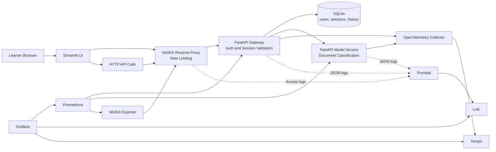

# Monitoring and Observability for MLOps

This repository supports a hands-on masterclass about architecture, monitoring, and observability in a small ML-oriented microservice system.

Use `main` as the entrypoint for the workshop structure, then move branch by branch to reproduce the progressive build-up of the platform.

## Branch Path

- `01-architecture-base`: core application, security boundaries, sessions, and SQLite persistence
- `02-monitoring-prometheus-grafana`: Prometheus and Grafana dashboards for API golden signals
- `03-observability-otel`: logs, traces, correlation, and root-cause analysis

## What Students Learn Across the Repository

- How to decompose a simple ML application into explicit services
- How to monitor APIs with a small set of useful signals
- How to move from symptom detection to investigation
- How to reproduce behaviors locally with commands instead of slides alone

## Model Used Across the Workshop

The repository currently uses a deterministic keyword-based classifier implemented in [src/masterclass_mlops/model_logic.py](/Users/seb/Documents/masterclass_monitoring_observability_mlops/src/masterclass_mlops/model_logic.py) on the runnable branches.

It is not a trained statistical model. This is intentional:

- the service behavior stays deterministic
- branch diffs stay easy to read
- students focus on architecture, monitoring, and observability

If you later want a trained model, this repository already gives you the right service boundaries to swap the inference logic without redesigning the system.

## Target Architecture



## Recommended Workshop Flow

1. Read this branch and the outline in [docs/masterclass-outline.md](/Users/seb/Documents/masterclass_monitoring_observability_mlops/docs/masterclass-outline.md).
2. Switch to `01-architecture-base` and run the base stack.
3. Switch to `02-monitoring-prometheus-grafana` and reproduce the monitoring exercises.
4. Switch to `03-observability-otel` and reproduce the investigation exercises.

## Commands to Move Through the Masterclass

```bash
git checkout 01-architecture-base
make install
make test
make up

git checkout 02-monitoring-prometheus-grafana
make test
make up

git checkout 03-observability-otel
make test
make up
```

Common cleanup command:

```bash
docker compose down --remove-orphans
```

## Supporting Notes

- Workshop outline: [docs/masterclass-outline.md](/Users/seb/Documents/masterclass_monitoring_observability_mlops/docs/masterclass-outline.md)
