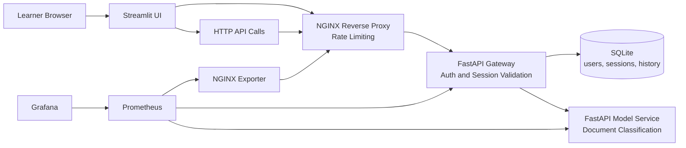

# MLOps Monitoring Masterclass Branch

This branch adds monitoring to the base application. It is the branch used to answer the question: "What is happening in the system?"

## What Students Explore

- How to instrument APIs with Prometheus-compatible metrics
- How to monitor traffic, errors, latency, and saturation
- How to keep a dashboard readable and focused on useful signals
- Why metrics are strong for symptoms and weak for root-cause analysis

## Model Used in This Branch

The current classifier is a deterministic keyword-based model implemented in [src/masterclass_mlops/model_logic.py](/Users/seb/Documents/masterclass_monitoring_observability_mlops/src/masterclass_mlops/model_logic.py).

It is not a trained statistical model. This keeps the workshop focused on service behavior and monitoring instead of training pipelines.

## Architecture Diagram



## Prerequisites

- Docker and Docker Compose
- `uv`
- Bash

## Run the Branch

```bash
make install
make lint
make typecheck
make test
make up
```

Open these services after startup:

- Streamlit UI: `http://localhost:8501`
- Public API through NGINX: `http://localhost:8080`
- Grafana: `http://localhost:3000`
- Prometheus: `http://localhost:9090`

Default demo users:

- `alice / mlops-demo`
- `bob / mlops-demo`

## Masterclass Manipulations

### 1. Create traffic through the UI or the API

```bash
TOKEN="$(curl -s http://localhost:8080/auth/login \
  -H 'Content-Type: application/json' \
  -d '{"username":"alice","password":"mlops-demo"}' \
  | python3 -c 'import sys, json; print(json.load(sys.stdin)["access_token"])')"

curl -s http://localhost:8080/api/classify \
  -H "Authorization: Bearer ${TOKEN}" \
  -H 'Content-Type: application/json' \
  -d '{"text":"My payment failed and I need a refund for my subscription."}'
```

What to observe in Grafana:

- request rate on the gateway
- prediction activity by label
- active sessions

### 2. Reproduce authentication errors

```bash
curl -i -s http://localhost:8080/auth/login \
  -H 'Content-Type: application/json' \
  -d '{"username":"alice","password":"wrong-password"}'
```

What to observe in Grafana:

- error rate on the gateway
- difference between normal traffic and failing traffic

### 3. Reproduce a burst of requests

```bash
for _ in $(seq 1 12); do
  curl -s -o /dev/null -w '%{http_code}\n' http://localhost:8080/auth/login \
    -H 'Content-Type: application/json' \
    -d '{"username":"alice","password":"mlops-demo"}'
done
```

What to observe in Grafana:

- traffic spike
- 4xx responses from the ingress path
- active NGINX connections and in-progress requests

### 4. Inspect raw metrics

```bash
curl -s http://localhost:8080/metrics | grep masterclass_http_requests_total
curl -s http://localhost:9090/api/v1/targets
```

Use this to show students:

- what Prometheus scrapes
- how application metrics look before dashboards

## Useful Commands

```bash
docker compose ps
docker compose logs -f prometheus
docker compose logs -f grafana
docker compose down --remove-orphans
```

## Branch Context

- Architecture notes: [docs/architecture-base.md](/Users/seb/Documents/masterclass_monitoring_observability_mlops/docs/architecture-base.md)
- Monitoring notes: [docs/monitoring-prometheus-grafana.md](/Users/seb/Documents/masterclass_monitoring_observability_mlops/docs/monitoring-prometheus-grafana.md)
