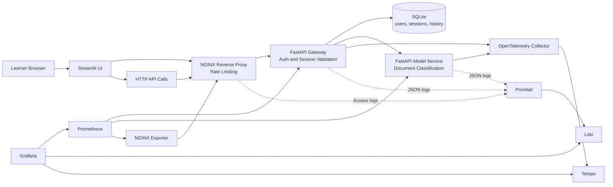

# Monitoring and Observability for MLOps

This repository is a hands-on masterclass. You will build, monitor, and observe a small ML application step by step, one branch at a time.

The starting point is a business need: classifying support messages. From there, we progressively answer three questions that matter in production MLOps:

1. **How should the application be structured?** (architecture)
2. **How do we know what is happening?** (monitoring)
3. **How do we find out why something went wrong?** (observability)

## Branch Path

Each branch builds on the previous one. Start from the top and work your way down:

- **`01-architecture-base`** -- Build the application: services, authentication, sessions, persistence. Understand why each piece exists.
- **`02-monitoring-prometheus-grafana`** -- Add Prometheus and Grafana. Learn to read dashboards and detect symptoms: traffic, errors, latency, saturation.
- **`03-observability-otel`** -- Add logs and traces. Learn to investigate root causes: follow a single request across services, understand why it was slow, and distinguish application problems from edge failures.

## What You Will Learn

- How to go from a business requirement to a structured, deployable ML application
- How to monitor APIs using a small set of meaningful signals
- How to move from "something is wrong" (monitoring) to "here is why" (observability)
- How to reproduce and investigate real behaviors locally with commands, not slides

## Model Used Across the Workshop

The runnable branches use a deterministic keyword-based classifier implemented in the `src/shared/` layer.

It is not a trained statistical model. This is intentional:

- the service behavior stays deterministic
- branch diffs stay easy to read
- students focus on architecture, monitoring, and observability

If you later want a trained model, this repository already gives you the right service boundaries to swap the inference logic without redesigning the system.

The source code follows a service-first layout:

- `src/services/` -- gateway and model service
- `src/ui/` -- Streamlit application
- `src/shared/` -- shared models, schemas, persistence, metrics, and support code

## Target Architecture

This is the full architecture you will build across all three branches. Each branch adds a layer: first the application services, then monitoring, then observability.



## How to Follow the Masterclass

1. Start here on `main` to understand the business context and the overall plan. Read the workshop outline in [docs/masterclass-outline.md](docs/masterclass-outline.md) for the full progression.
2. Switch to `01-architecture-base`, run the stack, and explore the application architecture.
3. Switch to `02-monitoring-prometheus-grafana`, run the stack, and learn to read monitoring dashboards.
4. Switch to `03-observability-otel`, run the stack, and practice investigating with logs and traces.

Each branch has its own README with step-by-step manipulations. Follow them in order.

## Commands to Move Through the Branches

```bash
git checkout 01-architecture-base
make install
make test
make up

git checkout 02-monitoring-prometheus-grafana
make test
make up

git checkout 03-observability-otel
make test
make up
```

Between branches, clean up the running containers:

```bash
docker compose down --remove-orphans
```

## Supporting Notes

- Workshop outline: [docs/masterclass-outline.md](docs/masterclass-outline.md)
