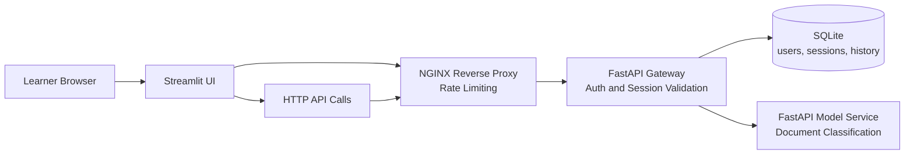

# MLOps Architecture Base Branch

This branch contains the base application used in the masterclass. It is the branch used to explain the use case, the service boundaries, and the first security and persistence choices.

## What Students Explore

- Why the application is split into UI, ingress, gateway, persistence, and model service
- Where authentication, session validation, and rate limiting live
- How a request flows through the system
- Why SQLite is a useful teaching database for a local microservice demo

## Model Used in This Branch

The current classifier is a deterministic keyword-based model implemented in [src/masterclass_mlops/model_logic.py](/Users/seb/Documents/masterclass_monitoring_observability_mlops/src/masterclass_mlops/model_logic.py).

It is not a trained statistical model. This keeps the branch focused on architecture and request flow.

## Architecture Diagram



## Prerequisites

- Docker and Docker Compose
- `uv`
- Bash

## Run the Branch

```bash
make install
make lint
make typecheck
make test
make up
```

Open these services after startup:

- Streamlit UI: `http://localhost:8501`
- Public API through NGINX: `http://localhost:8080`

Default demo users:

- `alice / mlops-demo`
- `bob / mlops-demo`

## Masterclass Manipulations

### 1. Log in and inspect the session flow

```bash
curl -i -s http://localhost:8080/auth/login \
  -H 'Content-Type: application/json' \
  -d '{"username":"alice","password":"mlops-demo"}'
```

What to discuss:

- the request enters through NGINX
- the gateway validates credentials
- a session token is created and stored in SQLite

### 2. Classify a document through the gateway

```bash
TOKEN="$(curl -s http://localhost:8080/auth/login \
  -H 'Content-Type: application/json' \
  -d '{"username":"alice","password":"mlops-demo"}' \
  | python3 -c 'import sys, json; print(json.load(sys.stdin)["access_token"])')"

curl -i -s http://localhost:8080/api/classify \
  -H "Authorization: Bearer ${TOKEN}" \
  -H 'Content-Type: application/json' \
  -d '{"text":"My profile login does not work after the password reset."}'
```

What to discuss:

- why the UI never talks directly to the model service
- why the gateway owns auth and routing
- how recent prediction history is tied to the session

### 3. Reproduce an unauthenticated failure

```bash
curl -i -s http://localhost:8080/api/classify \
  -H 'Content-Type: application/json' \
  -d '{"text":"My payment failed and I need help."}'
```

What to discuss:

- why the request is rejected
- why the gateway is the right boundary for this control

### 4. Inspect the SQLite file used by the application

```bash
ls -lh data/
sqlite3 data/masterclass.db '.tables'
sqlite3 data/masterclass.db 'select username from users;'
sqlite3 data/masterclass.db 'select id, user_id, expires_at from sessions;'
```

Use this to show students:

- persisted users
- persisted sessions
- why SQLite is easy to inspect during a workshop

## Useful Commands

```bash
docker compose ps
docker compose logs -f gateway
docker compose logs -f model-service
docker compose down --remove-orphans
```

## Branch Context

- Architecture notes: [docs/architecture-base.md](/Users/seb/Documents/masterclass_monitoring_observability_mlops/docs/architecture-base.md)
