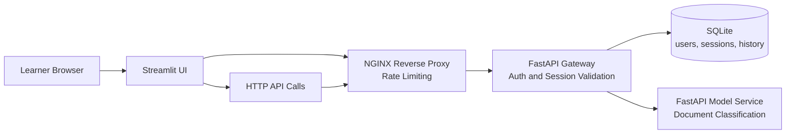

# MLOps Architecture Base Branch

This is the first hands-on branch of the masterclass. The `main` branch defined what we need to build and why. Now we build it.

This branch contains the running application: a small ML system that classifies support messages. The goal here is not to train a model, but to understand **how the application is structured** and **why each service exists**.

## Why Architecture Matters in MLOps

In production, an ML model is never just a model. It needs an API to receive requests, authentication to control access, a database to persist sessions and history, and a reverse proxy to protect the system from overload. If you skip these concerns, you end up with a fragile prototype that breaks the moment real users interact with it.

This branch sets up all those pieces so that in the next branches, you can focus on monitoring and observability without worrying about the foundation.

## What You Will Explore

- How the application is split into distinct services, each with a clear responsibility
- How a user request travels from the browser through NGINX, the gateway, and the model service
- Where authentication and session management live, and why those choices matter
- How to inspect the database to see what the application persists

## Model Used in This Branch

The current classifier is a deterministic keyword-based model implemented in [src/shared/model_logic.py](src/shared/model_logic.py).

It is not a trained statistical model. This keeps the branch focused on architecture and request flow.

## Architecture Diagram

Reading from left to right:

1. The learner interacts through a **Streamlit UI** or direct API calls
2. All requests pass through **NGINX**, which acts as a reverse proxy and applies rate limiting
3. The **Gateway** handles authentication, sessions, and forwards classification requests to the **Model Service**
4. The **Model Service** performs the actual text classification
5. **SQLite** stores users, sessions, and prediction history on a local file that you can inspect directly



## Prerequisites

- Docker and Docker Compose
- `uv`
- Bash

## Run the Branch

```bash
make install
make lint
make typecheck
make test
make up
```

Open these services after startup:

- Streamlit UI: `http://localhost:8501`
- Public API through NGINX: `http://localhost:8080`

Default demo users:

- `alice / mlops-demo`
- `bob / mlops-demo`

## Masterclass Manipulations

The manipulations below walk through the main request flow step by step. Each one highlights a different architectural decision and why it exists.

### 1. Log in and observe the session flow

**Why this step matters:** This is the entry point of the application. When a user logs in, the request travels through NGINX, reaches the gateway, which validates the credentials and creates a session token stored in SQLite. Understanding this flow is essential because it shows where security boundaries live.

```bash
curl -i -s http://localhost:8080/auth/login \
  -H 'Content-Type: application/json' \
  -d '{"username":"alice","password":"mlops-demo"}'
```

**What to observe:**

- The response contains an `access_token` that the client must send with every future request
- The token was created by the gateway, not by the UI or the model service
- A session was persisted in SQLite, so it survives a service restart

**Key takeaway:** The gateway owns authentication. No other service needs to know how passwords are validated.

### 2. Classify a document through the full request path

**Why this step matters:** This is the core business flow. The user sends a text, the gateway validates the session, forwards the text to the model service, stores the result in history, and returns everything to the client. This shows why the gateway is the orchestrator: it connects authentication, inference, and persistence without exposing any of them directly.

```bash
TOKEN="$(curl -s http://localhost:8080/auth/login \
  -H 'Content-Type: application/json' \
  -d '{"username":"alice","password":"mlops-demo"}' \
  | python3 -c 'import sys, json; print(json.load(sys.stdin)["access_token"])')"

curl -i -s http://localhost:8080/api/classify \
  -H "Authorization: Bearer ${TOKEN}" \
  -H 'Content-Type: application/json' \
  -d '{"text":"My profile login does not work after the password reset."}'
```

**What to observe:**

- The response includes a predicted label, a confidence score, and recent prediction history for this session
- The UI never talks to the model service directly: the gateway handles everything
- Prediction history is tied to the session, so each user has their own context

**Key takeaway:** Separating the gateway from the model service means you can change, scale, or replace the model without touching authentication or routing logic.

### 3. Try to classify without authentication

**Why this step matters:** This step sends a classification request without a token. The gateway rejects it immediately. The model service never sees the request. This is the security boundary in action: the gateway protects downstream services from unauthorized access.

```bash
curl -i -s http://localhost:8080/api/classify \
  -H 'Content-Type: application/json' \
  -d '{"text":"My payment failed and I need help."}'
```

**What to observe:**

- The response is a `401 Unauthorized` or `403 Forbidden`
- The model service logs show nothing for this request: it was stopped at the gateway

**Key takeaway:** The gateway is the right place for access control. If every service had to check authentication independently, the system would be harder to secure and maintain.

### 4. Inspect the database directly

**Why this step matters:** One advantage of SQLite for a workshop is that you can open the database file and look at what the application persisted. This makes the state visible and debuggable, which is harder with a remote database.

```bash
ls -lh data/
sqlite3 data/masterclass.db '.tables'
sqlite3 data/masterclass.db 'select username from users;'
sqlite3 data/masterclass.db 'select id, user_id, expires_at from sessions;'
```

**What to observe:**

- The `users` table contains the demo accounts
- The `sessions` table shows active sessions with expiration timestamps
- Everything the application stores is inspectable from the host machine

**Key takeaway:** In a local development or workshop setup, being able to inspect state directly accelerates understanding and debugging.

## Useful Commands

```bash
docker compose ps
docker compose logs -f gateway
docker compose logs -f model-service
docker compose down --remove-orphans
```

## Branch Context

- Architecture notes: [docs/architecture-base.md](docs/architecture-base.md)
