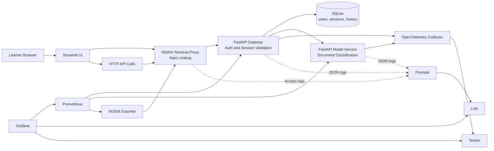

# MLOps Observability Masterclass Branch

In the previous branch, we added monitoring: Prometheus collects metrics and Grafana displays them as dashboards. We can now detect symptoms: traffic drops, errors spike, latency increases. But we cannot explain them. Which request caused the spike? Why was it slow? Where was time spent?

This branch activates the **observability non-functional requirement** defined on `main`. The question we now answer is: **why is it happening?**

## From Monitoring to Observability

Monitoring answers **what** is happening. Observability answers **why**. They are complementary, and both were planned as non-functional requirements from the very first design decisions.

In this branch, we add **logs** and **traces** on top of the existing metrics:

- **Logs** record what each service did during a request, with enough context to find a specific event across services
- **Traces** show the timing and structure of a request as it crosses multiple services, making it possible to see where time was spent

Together, metrics, logs, and traces form the three pillars of observability. Metrics tell you that something changed. Logs and traces tell you what happened and where to look.

## What You Will Explore

- How monitoring (Prometheus and Grafana) answers **"what is happening?"**
- How observability (logs and traces) answers **"why is it happening?"**
- How to follow a single request across multiple services using shared identifiers
- How to distinguish a slow application response from a request blocked at the entry point
- How these tools work together to move from a symptom to a root cause

## Model Used in This Branch

The current classifier is a deterministic keyword-based model implemented in [src/shared/model_logic.py](src/shared/model_logic.py).

It is not a trained statistical model. That is intentional for this masterclass:

- the architecture remains the focus, not the model itself
- predictions stay deterministic so the demos are reproducible
- the full inference logic is easy to inspect

## Architecture Diagram

The diagram below shows the full system. Reading it from left to right:

1. The learner interacts through a **Streamlit UI** or direct API calls
2. All requests pass through **NGINX**, which acts as a reverse proxy and applies rate limiting
3. The **Gateway** handles authentication, sessions, and forwards classification requests to the **Model Service**
4. On the monitoring side, **Prometheus** collects metrics from each service, and **Grafana** displays them as dashboards
5. On the observability side, services send **traces** through OpenTelemetry to **Tempo**, and **structured logs** through Promtail to **Loki**. Grafana brings everything together: metrics, logs, and traces in one place.



## Prerequisites

- Docker and Docker Compose
- `uv`
- Bash

## Run the Branch

```bash
make install
make lint
make typecheck
make test
make up
```

Open these services after startup:

- Streamlit UI: `http://localhost:8501`
- Public API through NGINX: `http://localhost:8080`
- Grafana: `http://localhost:3000`
- Prometheus: `http://localhost:9090`

Default demo users:

- `alice / mlops-demo`
- `bob / mlops-demo`
- `admin / mlops-demo`

If you log in through Streamlit with `admin / mlops-demo`, the UI exposes:

- an embedded monitoring cockpit from Grafana
- an embedded observability cockpit for logs and investigation views

## Readiness Check

After starting the stack, run this command to make sure everything is up and ready before starting the demo:

```bash
make demo-ready
```

This checks that the application, Prometheus, and Grafana are all responding. If everything is green, you are ready to start the manipulations.

<details>
<summary>Underlying commands and expected output</summary>

```bash
for url in \
  http://localhost:8080/health \
  http://localhost:9090/-/ready \
  http://localhost:3000/api/health
do
  echo "== $url =="
  curl -s "$url"
  echo
done
```

```text
== http://localhost:8080/health ==
{"status":"ok"}
== http://localhost:9090/-/ready ==
Prometheus Server is Ready.
== http://localhost:3000/api/health ==
{
  "database": "ok",
  "version": "11.6.0"
}
```

</details>

## Masterclass Manipulations

The manipulations below follow a progressive storyline. Each step builds on the previous one to show how monitoring and observability complement each other when investigating a production system.

### 1. Establish a healthy baseline

**Why this step matters:** Before investigating problems, you need to know what "normal" looks like. This first request is fast and successful. It gives you a reference point to compare against later.

```bash
make demo-fast
```

This logs in as a demo user and sends a short text to the classification endpoint.

**What to observe in the response:**

- The response comes back with status `200` and a very short processing time (around `0.05 ms`)
- The response header contains an `x-request-id`. This identifier is the first tool observability gives you: a way to find this specific request later in logs and traces

**Key takeaway:** Everything looks fine. The system is healthy. Remember this baseline for the next step.

<details>
<summary>Underlying commands and example output</summary>

```bash
LOGIN="$(curl -i -s http://localhost:8080/auth/login \
  -H 'Content-Type: application/json' \
  -d '{"username":"alice","password":"mlops-demo"}')"

TOKEN="$(printf '%s' "${LOGIN}" | tail -n 1 \
  | python3 -c 'import sys, json; print(json.load(sys.stdin)["access_token"])')"

sleep 2

curl -i -s http://localhost:8080/api/classify \
  -H "Authorization: Bearer ${TOKEN}" \
  -H 'Content-Type: application/json' \
  -d '{"text":"Refund please."}'
```

```text
HTTP/1.1 200 OK
Server: nginx/1.27.5
Content-Type: application/json
x-request-id: ztWg3aTI4AA

{"result":{"label":"billing","confidence":0.65,"processing_time_ms":0.05241700000624405},"history":[{"text":"Refund please.","predicted_label":"billing","confidence":0.65,"created_at":"2026-04-01T18:54:37.321445"}]}
```

</details>

### 2. Trigger a slow request and notice the difference

**Why this step matters:** This is the core teaching moment. We send a longer text that triggers a slower code path in the model. The response is still `200 OK`, the prediction is still correct, but it took **7000 times longer**. Without monitoring, nobody would notice. The user got an answer, but the experience was degraded.

This is where **monitoring** starts to shine: the Grafana dashboard will show a latency spike on the classify endpoint. You can see that something changed.

But monitoring alone only tells you **that** latency went up. It does not tell you **which** request caused it, or **why** it was slow. That is where observability picks up.

```bash
make demo-slow
```

**What to observe:**

- The response is still `200`, but `processing_time_ms` jumped from `0.05 ms` to roughly `353 ms`
- In Grafana, the latency panel shows a clear spike compared to the previous request
- A successful response does not always mean the system is healthy

**Key takeaway:** Monitoring detected the symptom (latency spike). Now we need observability to find the cause.

<details>
<summary>Underlying commands and example output</summary>

```bash
LOGIN="$(curl -i -s http://localhost:8080/auth/login \
  -H 'Content-Type: application/json' \
  -d '{"username":"alice","password":"mlops-demo"}')"

TOKEN="$(printf '%s' "${LOGIN}" | tail -n 1 \
  | python3 -c 'import sys, json; print(json.load(sys.stdin)["access_token"])')"

sleep 2

curl -i -s http://localhost:8080/api/classify \
  -H "Authorization: Bearer ${TOKEN}" \
  -H 'Content-Type: application/json' \
  -d '{"text":"My account login has latency issues after the password reset."}'
```

```text
HTTP/1.1 200 OK
Server: nginx/1.27.5
Content-Type: application/json
x-request-id: 1r59MPi1pEQ

{"result":{"label":"account","confidence":0.8500000000000001,"processing_time_ms":353.25243300030706},"history":[{"text":"My account login has latency issues after the password reset.","predicted_label":"account","confidence":0.8500000000000001,"created_at":"2026-04-01T18:54:37.681423"}]}
```

</details>

### 3. Follow the slow request across services using logs

**Why this step matters:** This is the step where observability proves its value. Using the `x-request-id` from the slow response, we search the logs of both services. Because each service writes structured logs with shared identifiers (`request_id`, `session_id`, `trace_id`), we can follow the exact journey of that one slow request across the gateway and the model service.

This is something monitoring alone cannot do. Metrics tell you "latency went up on the classify route." Logs tell you "this specific request, sent by this user, in this session, triggered the slow path in the model."

```bash
make demo-correlate
```

**What to observe:**

- The same `request_id` appears in both the gateway logs and the model-service logs
- The logs also share a `trace_id`, which links to the distributed trace in Tempo
- The model-service log shows `"slow_path": true`, which explains why this request was slow
- NGINX also logged the request, but with a different `request_id` (the ingress and application layers do not yet share identifiers end to end)

**Key takeaway:** Structured logs with shared identifiers let you reconstruct the full story of a single request across multiple services. That is the difference between knowing "something is slow" (monitoring) and knowing "this request was slow because it hit the model slow path" (observability).

<details>
<summary>Underlying commands and example output</summary>

```bash
REQUEST_ID="1r59MPi1pEQ"

rg -n "$REQUEST_ID" data/logs/gateway.log data/logs/model-service.log

tail -n 6 data/logs/nginx/access.log
```

```text
data/logs/model-service.log:7:{"timestamp":"2026-04-01T18:54:37.671663+00:00","message":"prediction_completed","service":"model-service","request_id":"1r59MPi1pEQ","session_id":"9","trace_id":"307026916f251c54ece9bec9c8328dad","slow_path":true}
data/logs/gateway.log:33:{"timestamp":"2026-04-01T18:54:37.677076+00:00","message":"HTTP Request: POST http://model-service:8001/predict \"HTTP/1.1 200 OK\"","service":"gateway","request_id":"1r59MPi1pEQ","session_id":"9","trace_id":"307026916f251c54ece9bec9c8328dad"}
data/logs/gateway.log:35:{"timestamp":"2026-04-01T18:54:37.691591+00:00","message":"prediction_recorded","service":"gateway","request_id":"1r59MPi1pEQ","session_id":9,"trace_id":"307026916f251c54ece9bec9c8328dad","label":"account"}

{"timestamp":"2026-04-01T18:54:37+00:00","service":"nginx","request_method":"POST","request_uri":"/api/classify","status":200,"request_time":0.408,"request_id":"d34cb267b41c7601651927f0b8ba59d4"}
```

Note: `make demo-slow` stores the latest request id in `data/logs/demo-last-request-id.txt`, and `make demo-correlate` reuses it automatically.

</details>

### 4. Observe a different kind of failure: ingress pressure

**Why this step matters:** Not all problems come from the application. Sometimes requests never even reach your services because they are blocked at the entry point. This step sends a burst of requests that triggers NGINX rate limiting. The first few succeed, but the rest are rejected with `503`.

This is a completely different investigation pattern compared to the slow request. The application logs will be empty for the rejected requests because the application never saw them. Only the NGINX (ingress) logs show what happened.

```bash
make demo-burst
```

**What to observe:**

- The first requests return `200`, then the rest return `503`
- In the Grafana monitoring dashboard, you can see the traffic spike and the error rate going up
- In the application logs, there is no trace of the rejected requests because they were stopped at NGINX before reaching the gateway

**Key takeaway:** Monitoring and observability work at different layers. A slow model response and a rate-limited burst are two completely different problems, and you need different tools to investigate each one. Knowing where to look is as important as having the tools.

<details>
<summary>Underlying commands and example output</summary>

```bash
for _ in $(seq 1 12); do
  curl -s -o /dev/null -w '%{http_code}\n' http://localhost:8080/auth/login \
    -H 'Content-Type: application/json' \
    -d '{"username":"alice","password":"mlops-demo"}'
done
```

```text
200
200
503
503
503
503
503
503
503
503
503
503
```

The exact number of initial `200` responses depends on traffic already sent in the current rate-limit window.

</details>

### 5. Verify the monitoring and observability backends

**Why this step matters:** This step confirms that all the infrastructure behind the demos is actually running and collecting data. It is a good way to close the loop and show that everything connects together.

```bash
make demo-backends
```

**What to observe:**

- Prometheus is actively scraping metrics from the gateway, model-service, and NGINX
- Grafana has both a monitoring dashboard (API Golden Signals) and an observability dashboard (Observability Overview) provisioned and ready to use

<details>
<summary>Underlying commands and example output</summary>

```bash
curl -s http://localhost:9090/api/v1/targets | python3 -c '
import sys, json
payload = json.load(sys.stdin)
for target in payload["data"]["activeTargets"]:
    print(target["labels"].get("job"), target["health"], target["scrapeUrl"])
'

curl -s http://localhost:3000/api/search | python3 -c '
import sys, json
for item in json.load(sys.stdin):
    print(item.get("title"), item.get("uid"), item.get("type"))
'
```

```text
gateway up http://gateway:8000/metrics
model-service up http://model-service:8001/metrics
nginx up http://nginx-exporter:9113/metrics

Masterclass <folder-uid> dash-folder
API Golden Signals api-golden-signals dash-db
Observability Overview observability-overview dash-db
```

</details>

## Summary: What Observability Adds Beyond Monitoring

| Question | Monitoring (metrics) | Observability (logs + traces) |
| --- | --- | --- |
| Is something wrong? | Latency spike on the dashboard | - |
| Which request caused it? | - | Search by `request_id` in logs |
| What path did the request take? | - | Follow the `trace_id` across services |
| Why was it slow? | - | Log shows `slow_path: true` |
| Where was time spent? | - | Trace shows timing per service |
| Was the failure in the app or at the edge? | Error rate went up | Logs show if the app or NGINX handled it |

Monitoring tells you something is happening. Observability tells you why it is happening and where to look. In production MLOps, you need both.

## Workshop Complete

With this branch, all the non-functional requirements defined on `main` are now addressed:

- **Architecture** (branch 01): services, authentication, persistence, rate limiting, metrics endpoints ready
- **Monitoring** (branch 02): Prometheus collects metrics, Grafana visualizes them, you can detect symptoms
- **Observability** (branch 03): structured logs and distributed traces let you investigate root causes

You started from a business need, defined requirements that included operational concerns from the start, and built toward full visibility one layer at a time.

## Useful Commands

```bash
docker compose ps
docker compose logs -f gateway
docker compose logs -f model-service
docker compose logs -f promtail
docker compose down --remove-orphans
```

## Branch Context

- Masterclass outline: [docs/masterclass-outline.md](docs/masterclass-outline.md)
- Architecture notes: [docs/architecture-base.md](docs/architecture-base.md)
- Monitoring notes: [docs/monitoring-prometheus-grafana.md](docs/monitoring-prometheus-grafana.md)
- Observability notes: [docs/observability-otel.md](docs/observability-otel.md)
