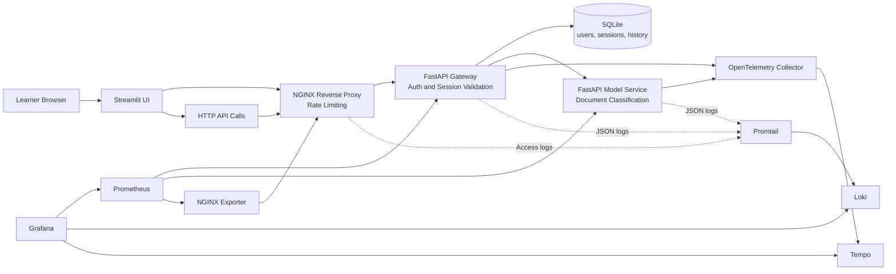

# MLOps Monitoring and Observability Masterclass

This branch is the final state of the workshop. It includes the base application, the monitoring stack, and the observability stack used to investigate root causes.

## What Students Explore

- How a small ML-oriented system is split into UI, ingress, gateway, persistence, and model service
- How Prometheus and Grafana answer "what is happening?"
- How logs and traces answer "why is it happening?"
- How to reproduce slow requests, authentication flows, and ingress-level failures

## Model Used in This Branch

The current classifier is a deterministic keyword-based model implemented in [src/masterclass_mlops/model_logic.py](/Users/seb/Documents/masterclass_monitoring_observability_mlops/src/masterclass_mlops/model_logic.py).

It is not a trained statistical model. That is intentional for this masterclass:

- the architecture remains the focus
- predictions stay deterministic during demos
- students can inspect the full inference logic quickly

## Architecture Diagram



## Prerequisites

- Docker and Docker Compose
- `uv`
- Bash

## Run the Branch

```bash
make install
make lint
make typecheck
make test
make up
```

Open these services after startup:

- Streamlit UI: `http://localhost:8501`
- Public API through NGINX: `http://localhost:8080`
- Grafana: `http://localhost:3000`
- Prometheus: `http://localhost:9090`

Default demo users:

- `alice / mlops-demo`
- `bob / mlops-demo`

## Masterclass Manipulations

### 1. Create a session and classify a document

```bash
TOKEN="$(curl -s http://localhost:8080/auth/login \
  -H 'Content-Type: application/json' \
  -d '{"username":"alice","password":"mlops-demo"}' \
  | python3 -c 'import sys, json; print(json.load(sys.stdin)["access_token"])')"

curl -i -s http://localhost:8080/api/classify \
  -H "Authorization: Bearer ${TOKEN}" \
  -H 'Content-Type: application/json' \
  -d '{"text":"My account login has latency issues after the password reset."}'
```

What to observe:

- `X-Request-ID` returned by the API
- prediction label and confidence
- request rate, latency, and errors in Grafana

### 2. Reproduce a slower inference path

```bash
curl -i -s http://localhost:8080/api/classify \
  -H "Authorization: Bearer ${TOKEN}" \
  -H 'Content-Type: application/json' \
  -d '{"text":"Please help, my account login has latency and timeout issues after password reset and the problem keeps happening across several screens in the product."}'
```

What to observe:

- higher latency on the `/api/classify` and `/predict` path
- a slower trace in Tempo
- correlated JSON logs in Loki for the same `request_id`

### 3. Reproduce ingress pressure and rate limiting

```bash
for _ in $(seq 1 12); do
  curl -s -o /dev/null -w '%{http_code}\n' http://localhost:8080/auth/login \
    -H 'Content-Type: application/json' \
    -d '{"username":"alice","password":"mlops-demo"}'
done
```

What to observe:

- `429` responses at the ingress layer
- NGINX access logs in Loki
- infrastructure metrics from the NGINX exporter

### 4. Inspect logs directly from the local files

```bash
tail -n 20 data/logs/gateway.log
tail -n 20 data/logs/model-service.log
tail -n 20 data/logs/nginx/access.log
```

Use these files to compare:

- `request_id`
- `trace_id`
- `session_id`
- gateway versus model-service timing context

## Useful Commands

```bash
docker compose ps
docker compose logs -f gateway
docker compose logs -f model-service
docker compose logs -f promtail
docker compose down --remove-orphans
```

## Branch Context

- Architecture notes: [docs/architecture-base.md](/Users/seb/Documents/masterclass_monitoring_observability_mlops/docs/architecture-base.md)
- Monitoring notes: [docs/monitoring-prometheus-grafana.md](/Users/seb/Documents/masterclass_monitoring_observability_mlops/docs/monitoring-prometheus-grafana.md)
- Observability notes: [docs/observability-otel.md](/Users/seb/Documents/masterclass_monitoring_observability_mlops/docs/observability-otel.md)
