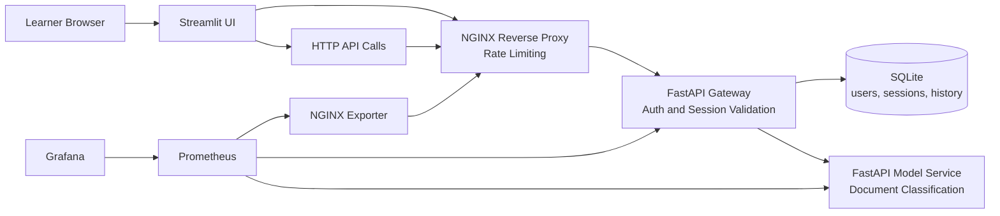

# MLOps Monitoring Masterclass Branch

In the previous branch, we built the application architecture: services, authentication, persistence, rate limiting. The structure is in place, and the services already expose metrics endpoints. But nothing collects those metrics yet.

This branch activates the **monitoring non-functional requirement** defined on `main`. The question we now answer is: **what is happening in the system?**

## Why Monitoring Matters

When you deploy an ML application, the code works, the model predicts, users interact with it. But how do you know things are going well? How do you notice if latency starts creeping up, if errors spike, or if traffic suddenly drops?

That is what monitoring answers. It gives you a continuous, real-time view of the system's health through **metrics**: numbers that describe what the system is doing right now.

In this branch, we add **Prometheus** and **Grafana** to the architecture:

- **Prometheus** collects metrics from each service at regular intervals (this is called scraping)
- **Grafana** turns those metrics into visual dashboards where you can spot trends, spikes, and anomalies at a glance

## What You Will Explore

- How to read a monitoring dashboard organized around four key signals: **traffic**, **errors**, **latency**, and **saturation**
- How to distinguish between a healthy system and a degraded one, even when all requests return `200`
- How to see the difference between a failure inside the application (wrong password) and a failure at the edge (rate limiting)
- Why monitoring is essential but not sufficient: it tells you **what** changed, but not **why**

## Model Used in This Branch

The current classifier is a deterministic keyword-based model implemented in [src/shared/model_logic.py](src/shared/model_logic.py).

It is not a trained statistical model. This keeps the workshop focused on service behavior and monitoring instead of training pipelines.

## Architecture Diagram

Compared to the architecture branch, the new additions are at the bottom: **Prometheus** scrapes metrics from the gateway, model service, and NGINX, and **Grafana** displays them as dashboards.



## Prerequisites

- Docker and Docker Compose
- `uv`
- Bash

## Run the Branch

```bash
make install
make lint
make typecheck
make test
make up
```

Open these services after startup:

- Streamlit UI: `http://localhost:8501`
- Public API through NGINX: `http://localhost:8080`
- Grafana: `http://localhost:3000`
- Prometheus: `http://localhost:9090`

Default demo users:

- `alice / mlops-demo`
- `bob / mlops-demo`
- `admin / mlops-demo`

If you log in through Streamlit with `admin / mlops-demo`, the UI exposes an embedded monitoring cockpit with the Grafana dashboard directly inside the application.

## Readiness Check

After starting the stack, run this command to make sure everything is up and ready:

```bash
make demo-ready
```

This checks that the application, Prometheus, and Grafana are all responding. If everything is green, you are ready to start the manipulations.

<details>
<summary>Underlying commands and expected output</summary>

```bash
for url in \
  http://localhost:8080/health \
  http://localhost:9090/-/ready \
  http://localhost:3000/api/health
do
  echo "== $url =="
  curl -s "$url"
  echo
done
```

```text
== http://localhost:8080/health ==
{"status":"ok"}
== http://localhost:9090/-/ready ==
Prometheus Server is Ready.
== http://localhost:3000/api/health ==
{
  "database": "ok",
  "version": "11.6.0"
}
```

</details>

## Masterclass Manipulations

The manipulations follow a progressive storyline. You start by generating healthy traffic, then introduce failures at different layers, and finally look under the hood at how metrics are collected.

### 1. Generate healthy traffic and observe the dashboard

**Why this step matters:** Before looking for problems, you need to see what a healthy system looks like on a dashboard. This step creates one login and one classification, which is enough for Grafana to show activity on all the key panels.

```bash
make demo-baseline
```

**What to observe in Grafana:**

- **Traffic** panels show that the gateway and model service each handled requests
- **Error rate** stays flat (no errors yet)
- **Latency** panels show very low response times
- **Prediction distribution** shows one `billing` prediction

**Key takeaway:** This is your baseline. When something goes wrong later, you will compare it to this healthy state. Monitoring is most useful when you already know what "normal" looks like.

<details>
<summary>Underlying commands and example output</summary>

```bash
LOGIN="$(curl -i -s http://localhost:8080/auth/login \
  -H 'Content-Type: application/json' \
  -d '{"username":"alice","password":"mlops-demo"}')"

printf '%s\n' "${LOGIN}"

TOKEN="$(printf '%s' "${LOGIN}" | tail -n 1 \
  | python3 -c 'import sys, json; print(json.load(sys.stdin)["access_token"])')"

sleep 5

curl -i -s http://localhost:8080/api/classify \
  -H "Authorization: Bearer ${TOKEN}" \
  -H 'Content-Type: application/json' \
  -d '{"text":"My payment failed and I need a refund for my subscription."}'
```

```text
HTTP/1.1 200 OK
Server: nginx/1.27.5
Content-Type: application/json

{"access_token":"<token>","token_type":"bearer","username":"alice","expires_at":"2026-04-01T20:23:00.579204"}

HTTP/1.1 200 OK
Server: nginx/1.27.5
Content-Type: application/json

{"result":{"label":"billing","confidence":0.8500000000000001,"processing_time_ms":0.029625000024680048},"history":[{"text":"My payment failed and I need a refund for my subscription.","predicted_label":"billing","confidence":0.8500000000000001,"created_at":"2026-04-01T18:53:06.422567"}]}
```

</details>

### 2. Trigger an authentication failure

**Why this step matters:** This step generates an error that comes from the application itself, not from the model. A user tries to log in with the wrong password. The gateway rejects the request with a `401`, and the model service is never involved.

On the dashboard, you will see the **error rate** go up on the authentication route, but the model service stays untouched. This teaches a fundamental monitoring skill: reading the dashboard to understand **where** in the system a failure is happening.

```bash
make demo-auth-failure
```

**What to observe in Grafana:**

- The error counter increases on `/auth/login`
- The model service panels are unchanged
- The failure is clearly isolated to the gateway authentication layer

**Key takeaway:** Not all errors are the same. Monitoring helps you separate problems at different layers: is it the edge? the gateway? the model? Knowing where to look saves time.

<details>
<summary>Underlying commands and example output</summary>

```bash
curl -i -s http://localhost:8080/auth/login \
  -H 'Content-Type: application/json' \
  -d '{"username":"alice","password":"wrong-password"}'
```

```text
HTTP/1.1 401 Unauthorized
Server: nginx/1.27.5
Content-Type: application/json

{"detail":"Invalid credentials"}
```

</details>

### 3. Reproduce ingress pressure with a burst of requests

**Why this step matters:** This time the problem is not in the application at all. We send 12 requests in quick succession, and NGINX rate limiting kicks in. The first few succeed, the rest are rejected with `503` before they ever reach the gateway.

This is a completely different pattern from the authentication failure. On the dashboard, you will see a traffic spike and errors, but the application-level metrics will not fully reflect the burst because most requests were blocked at the edge.

```bash
make demo-burst
```

**What to observe in Grafana:**

- NGINX active connections spike
- Some requests succeed, then `503` errors appear
- The gateway did not see all 12 requests because NGINX blocked most of them

**Key takeaway:** Monitoring covers multiple layers. Some problems happen before requests reach your application. If you only look at application metrics, you will miss edge-level failures entirely.

<details>
<summary>Underlying commands and example output</summary>

```bash
for _ in $(seq 1 12); do
  curl -s -o /dev/null -w '%{http_code}\n' http://localhost:8080/auth/login \
    -H 'Content-Type: application/json' \
    -d '{"username":"alice","password":"mlops-demo"}'
done
```

```text
200
200
200
200
503
503
503
503
503
503
503
503
```

The exact number of initial `200` responses depends on traffic already sent in the current rate-limit window.

</details>

### 4. Look under the hood: how metrics are collected

**Why this step matters:** So far you have looked at Grafana dashboards. But where does the data come from? This step shows you the raw metrics pipeline: each service exposes a `/metrics` endpoint internally, Prometheus scrapes it regularly, and Grafana queries Prometheus.

Understanding this pipeline helps you debug situations where a dashboard looks empty or wrong: is the service exposing metrics? Is Prometheus scraping them? Is the query correct?

```bash
make demo-targets
```

**What to observe:**

- Prometheus shows three active scrape targets: gateway, model-service, and NGINX exporter
- You can query raw metric values directly from Prometheus and see the same numbers that Grafana displays

<details>
<summary>Underlying commands and example output</summary>

```bash
curl -i -s http://localhost:8080/metrics

curl -s http://localhost:9090/api/v1/targets | python3 -c '
import sys, json
payload = json.load(sys.stdin)
for target in payload["data"]["activeTargets"]:
    print(target["labels"].get("job"), target["health"], target["scrapeUrl"])
'

curl -s 'http://localhost:9090/api/v1/query?query=masterclass_http_requests_total' \
  | python3 -c '
import sys, json
payload = json.load(sys.stdin)
for item in payload["data"]["result"][:8]:
    print(item["metric"], item["value"][1])
'
```

```text
HTTP/1.1 404 Not Found
Server: nginx/1.27.5
Content-Type: text/html

gateway up http://gateway:8000/metrics
model-service up http://model-service:8001/metrics
nginx up http://nginx-exporter:9113/metrics

{'__name__': 'masterclass_http_requests_total', 'instance': 'gateway:8000', 'job': 'gateway', 'method': 'POST', 'path': '/auth/login', 'service': 'gateway', 'status': '401'} 1
{'__name__': 'masterclass_http_requests_total', 'instance': 'gateway:8000', 'job': 'gateway', 'method': 'POST', 'path': '/auth/login', 'service': 'gateway', 'status': '200'} 2
{'__name__': 'masterclass_http_requests_total', 'instance': 'gateway:8000', 'job': 'gateway', 'method': 'POST', 'path': '/api/classify', 'service': 'gateway', 'status': '200'} 1
{'__name__': 'masterclass_http_requests_total', 'instance': 'model-service:8001', 'job': 'model-service', 'method': 'POST', 'path': '/predict', 'service': 'model-service', 'status': '200'} 1
```

Note: the `404` on `http://localhost:8080/metrics` is expected. The public NGINX route does not expose the metrics endpoint. Prometheus scrapes metrics directly from the internal service addresses.

</details>

## What Monitoring Can and Cannot Do

Monitoring answers:

- **Is traffic reaching the system?**
- **Are errors increasing?**
- **Is latency rising?**
- **Is the system under pressure?**

Monitoring does not answer:

- Which specific request caused the problem?
- What context did that request carry?
- Where exactly was time spent inside the request?

Those deeper questions require **observability** (logs and traces), which is the subject of the next branch.

## What Comes Next

Monitoring tells you that something changed. But when latency spikes, you cannot tell which request caused it, or why it was slow. The next branch adds **logs and traces** to answer the question: **why is it happening?**

Continue to `03-observability-otel`.

## Useful Commands

```bash
docker compose ps
docker compose logs -f prometheus
docker compose logs -f grafana
docker compose down --remove-orphans
```

## Branch Context

- Masterclass outline: [docs/masterclass-outline.md](docs/masterclass-outline.md)
- Architecture notes: [docs/architecture-base.md](docs/architecture-base.md)
- Monitoring notes: [docs/monitoring-prometheus-grafana.md](docs/monitoring-prometheus-grafana.md)
