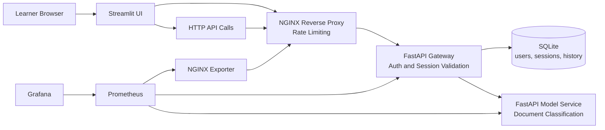

# MLOps Monitoring Masterclass Branch

This branch adds monitoring to the base application. It is the branch used to answer the question: `What is happening in the system?`

## What Students Explore

- How to instrument APIs with Prometheus-compatible metrics
- How to monitor traffic, errors, latency, and saturation
- How to keep a dashboard readable and focused on useful signals
- Why metrics are strong for symptoms and weak for root-cause analysis

## Model Used in This Branch

The current classifier is a deterministic keyword-based model implemented in [src/shared/model_logic.py](src/shared/model_logic.py).

It is not a trained statistical model. This keeps the workshop focused on service behavior and monitoring instead of training pipelines.

## Architecture Diagram



## Prerequisites

- Docker and Docker Compose
- `uv`
- Bash

## Run the Branch

```bash
make install
make lint
make typecheck
make test
make up
```

Open these services after startup:

- Streamlit UI: `http://localhost:8501`
- Public API through NGINX: `http://localhost:8080`
- Grafana: `http://localhost:3000`
- Prometheus: `http://localhost:9090`

Default demo users:

- `alice / mlops-demo`
- `bob / mlops-demo`
- `admin / mlops-demo`

If you log in through Streamlit with `admin / mlops-demo`, the UI exposes an embedded monitoring cockpit with the Grafana dashboard directly inside the application.

## Readiness Check

Run this once after `make up` so the first demo does not mix startup noise with the teaching flow.

Shortcut:

```bash
make demo-ready
```

```bash
for url in \
  http://localhost:8080/health \
  http://localhost:9090/-/ready \
  http://localhost:3000/api/health
do
  echo "== $url =="
  curl -s "$url"
  echo
done
```

Example output:

```text
== http://localhost:8080/health ==
{"status":"ok"}
== http://localhost:9090/-/ready ==
Prometheus Server is Ready.
== http://localhost:3000/api/health ==
{
  "database": "ok",
  "version": "11.6.0"
}
```

What to comment live:

- The application is reachable through NGINX before any user traffic is generated.
- Prometheus and Grafana are both ready, so dashboard observations should be trustworthy.

## Masterclass Manipulations

### 1. Create baseline traffic

Goal:
Show one healthy login and one healthy classification before opening Grafana.

Shortcut:

```bash
make demo-baseline
```

Underlying commands:

```bash
LOGIN="$(curl -i -s http://localhost:8080/auth/login \
  -H 'Content-Type: application/json' \
  -d '{"username":"alice","password":"mlops-demo"}')"

printf '%s\n' "${LOGIN}"

TOKEN="$(printf '%s' "${LOGIN}" | tail -n 1 \
  | python3 -c 'import sys, json; print(json.load(sys.stdin)["access_token"])')"

sleep 5

curl -i -s http://localhost:8080/api/classify \
  -H "Authorization: Bearer ${TOKEN}" \
  -H 'Content-Type: application/json' \
  -d '{"text":"My payment failed and I need a refund for my subscription."}'
```

Example output:

```text
HTTP/1.1 200 OK
Server: nginx/1.27.5
Content-Type: application/json

{"access_token":"<token>","token_type":"bearer","username":"alice","expires_at":"2026-04-01T20:23:00.579204"}

HTTP/1.1 200 OK
Server: nginx/1.27.5
Content-Type: application/json

{"result":{"label":"billing","confidence":0.8500000000000001,"processing_time_ms":0.029625000024680048},"history":[{"text":"My payment failed and I need a refund for my subscription.","predicted_label":"billing","confidence":0.8500000000000001,"created_at":"2026-04-01T18:53:06.422567"}]}
```

What changed operationally:

- The gateway handled one successful login and one successful classify request.
- The model service produced one `billing` prediction.
- Prometheus now has healthy traffic to scrape and Grafana has something visible to plot.

How to explain it live:

- Start with the business view: a user logged in and classified one support ticket.
- Translate that into monitoring language: request rate increased, error rate stayed flat, prediction count rose for `billing`.

Common learner confusion:

- Learners often expect the UI to call the model directly. Point out that the gateway owns authentication and orchestration.
- Learners may focus on the tiny latency value only. Remind them that one request is not a trend; metrics matter over time.

### 2. Reproduce an authentication failure

Goal:
Generate a clean application-side error without involving the model service.

Shortcut:

```bash
make demo-auth-failure
```

Underlying command:

```bash
curl -i -s http://localhost:8080/auth/login \
  -H 'Content-Type: application/json' \
  -d '{"username":"alice","password":"wrong-password"}'
```

Example output:

```text
HTTP/1.1 401 Unauthorized
Server: nginx/1.27.5
Content-Type: application/json

{"detail":"Invalid credentials"}
```

What changed operationally:

- Gateway error traffic increased on `/auth/login`.
- The model service did not participate in this failure.

How to explain it live:

- This is a useful monitoring contrast: traffic exists, but the failure is clearly attached to authentication.
- Students should learn to separate “edge failure”, “gateway failure”, and “model failure”.

Common learner confusion:

- `401` here is not a Prometheus or Grafana issue. It is correct application behavior.

### 3. Reproduce ingress pressure

Goal:
Show how the public edge reacts to a burst of requests before the application itself becomes the main story.

Shortcut:

```bash
make demo-burst
```

Underlying command:

```bash
for _ in $(seq 1 12); do
  curl -s -o /dev/null -w '%{http_code}\n' http://localhost:8080/auth/login \
    -H 'Content-Type: application/json' \
    -d '{"username":"alice","password":"mlops-demo"}'
done
```

Example output:

```text
200
200
200
200
503
503
503
503
503
503
503
503
```

What changed operationally:

- Traffic spiked at the ingress.
- In the current stack, NGINX rate limiting surfaces as `503` in the verified demo output.
- Gateway traffic stops reflecting the full burst because some requests are blocked before they reach the application.
- The exact cutover point between `200` and `503` depends on how much traffic was already sent in the current rate-limit window.

How to explain it live:

- This is the moment to discuss edge protection and back-pressure.
- The important lesson is not the exact status code. The important lesson is that the edge can absorb or reject pressure before the services do.

Common learner confusion:

- Older explanations often expect `429`. In this branch, the verified terminal behavior is `503`, so the documentation follows the real stack.

### 4. Inspect raw monitoring evidence

Goal:
Show students where Grafana gets its data and how to inspect the metrics path without using the dashboard first.

Shortcut:

```bash
make demo-targets
```

Underlying commands:

```bash
curl -i -s http://localhost:8080/metrics

curl -s http://localhost:9090/api/v1/targets | python3 -c '
import sys, json
payload = json.load(sys.stdin)
for target in payload["data"]["activeTargets"]:
    print(target["labels"].get("job"), target["health"], target["scrapeUrl"])
'

curl -s 'http://localhost:9090/api/v1/query?query=masterclass_http_requests_total' \
  | python3 -c '
import sys, json
payload = json.load(sys.stdin)
for item in payload["data"]["result"][:8]:
    print(item["metric"], item["value"][1])
'
```

Example output:

```text
HTTP/1.1 404 Not Found
Server: nginx/1.27.5
Content-Type: text/html

<html>
<head><title>404 Not Found</title></head>
...

gateway up http://gateway:8000/metrics
model-service up http://model-service:8001/metrics
nginx up http://nginx-exporter:9113/metrics

{'__name__': 'masterclass_http_requests_total', 'instance': 'gateway:8000', 'job': 'gateway', 'method': 'POST', 'path': '/auth/login', 'service': 'gateway', 'status': '401'} 1
{'__name__': 'masterclass_http_requests_total', 'instance': 'gateway:8000', 'job': 'gateway', 'method': 'POST', 'path': '/auth/login', 'service': 'gateway', 'status': '200'} 2
{'__name__': 'masterclass_http_requests_total', 'instance': 'gateway:8000', 'job': 'gateway', 'method': 'POST', 'path': '/api/classify', 'service': 'gateway', 'status': '200'} 1
{'__name__': 'masterclass_http_requests_total', 'instance': 'model-service:8001', 'job': 'model-service', 'method': 'POST', 'path': '/predict', 'service': 'model-service', 'status': '200'} 1
```

What changed operationally:

- Nothing new happened to the application. This step inspects what was already collected.
- The current NGINX public surface does not expose `/metrics`, so Prometheus is the reliable raw entrypoint.

How to explain it live:

- Metrics usually exist on internal scrape paths, not necessarily on the public API.
- Prometheus is the source of truth for “what was scraped” and “which targets are healthy”.

Common learner confusion:

- A `404` on `http://localhost:8080/metrics` does not mean monitoring is broken. It means that this public route is not wired to the gateway metrics endpoint in the current stack.

## Useful Commands

```bash
docker compose ps
docker compose logs -f prometheus
docker compose logs -f grafana
docker compose down --remove-orphans
```

## Branch Context

- Architecture notes: [docs/architecture-base.md](docs/architecture-base.md)
- Monitoring notes: [docs/monitoring-prometheus-grafana.md](docs/monitoring-prometheus-grafana.md)
