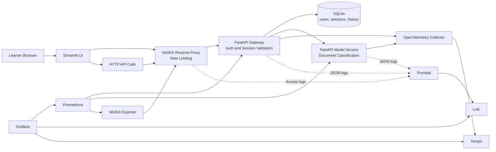

# Monitoring and Observability for MLOps

This repository is a hands-on masterclass. You will build, monitor, and observe a small ML application step by step, one branch at a time.

## It Starts with a Business Need

A support team needs to classify incoming messages into categories (`billing`, `technical`, `account`) so they can route them faster. That is the business problem.

But building a working classifier is only the beginning. In production MLOps, the real questions come after deployment:

- How do we structure the application so it is secure, maintainable, and ready to operate?
- How do we know the system is healthy once it runs?
- How do we find out what went wrong when something breaks?

These are not afterthoughts. **Monitoring and observability must be planned from the very first design decisions.** The architecture you choose, the way you split services, the boundaries you define: all of these determine how easy or hard it will be to monitor and debug the system later.

This masterclass follows that exact progression.

## Requirements That Guide the Entire Workshop

Before writing any code, we define what the system needs to do and how it needs to behave. These requirements drive every architectural and operational choice across all branches.

**Functional requirements:**

- A user can authenticate and receive a session
- An authenticated user can classify a support message
- The application returns a label, a confidence score, and recent prediction history
- The system rejects unauthenticated requests

**Non-functional requirements:**

- The public entry point must apply rate limiting to protect the system
- Services must be isolated enough to scale, replace, or troubleshoot independently
- The system must expose metrics so we can monitor its health
- The system must produce structured logs and traces so we can investigate individual requests
- Application state must be inspectable locally

Notice that monitoring and observability appear in the non-functional requirements from the start. They are not features you bolt on later. They are constraints that shape how you build the application.

## Branch Path

Each branch implements a part of these requirements. Start from the top and work your way down:

- **`01-architecture-base`** -- Implement the application architecture: services, authentication, sessions, persistence, rate limiting. The structure already anticipates monitoring and observability by exposing metrics endpoints and isolating services with clear boundaries.
- **`02-monitoring-prometheus-grafana`** -- Add Prometheus and Grafana. Answer the question **"what is happening?"** by collecting and visualizing metrics. Check off the monitoring non-functional requirement.
- **`03-observability-otel`** -- Add logs and traces. Answer the question **"why is it happening?"** by correlating requests across services. Check off the observability non-functional requirement.

## What You Will Learn

- How to go from a business need to functional and non-functional requirements that include operational concerns from day one
- How architecture choices enable (or block) monitoring and observability
- How to monitor APIs using a small set of meaningful signals
- How to move from "something is wrong" (monitoring) to "here is why" (observability)
- How to reproduce and investigate real behaviors locally with commands, not slides

## Model Used Across the Workshop

The runnable branches use a deterministic keyword-based classifier implemented in the `src/shared/` layer.

It is not a trained statistical model. This is intentional:

- the service behavior stays deterministic
- branch diffs stay easy to read
- students focus on architecture, monitoring, and observability

If you later want a trained model, this repository already gives you the right service boundaries to swap the inference logic without redesigning the system.

The source code follows a service-first layout:

- `src/services/` -- gateway and model service
- `src/ui/` -- Streamlit application
- `src/shared/` -- shared models, schemas, persistence, metrics, and support code

## Target Architecture

This is the full architecture you will build across all three branches. Each branch adds a layer: first the application services, then monitoring, then observability.



## How to Follow the Masterclass

1. Start here on `main` to understand the business context and the overall plan. Read the workshop outline in [docs/masterclass-outline.md](docs/masterclass-outline.md) for the full progression.
2. Switch to `01-architecture-base`, run the stack, and explore the application architecture.
3. Switch to `02-monitoring-prometheus-grafana`, run the stack, and learn to read monitoring dashboards.
4. Switch to `03-observability-otel`, run the stack, and practice investigating with logs and traces.

Each branch has its own README with step-by-step manipulations. Follow them in order.

## Commands to Move Through the Branches

```bash
git checkout 01-architecture-base
make install
make test
make up

git checkout 02-monitoring-prometheus-grafana
make test
make up

git checkout 03-observability-otel
make test
make up
```

Between branches, clean up the running containers:

```bash
docker compose down --remove-orphans
```

## Supporting Notes

- Workshop outline: [docs/masterclass-outline.md](docs/masterclass-outline.md)
