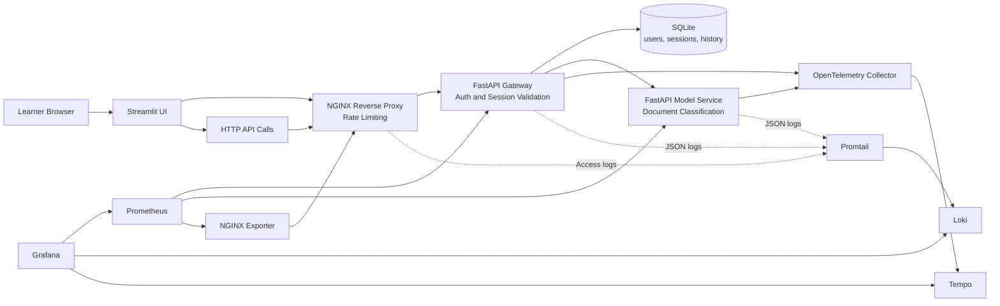

# MLOps Monitoring and Observability Masterclass

This branch is the final state of the workshop. It includes the base application, the monitoring stack, and the observability stack used to investigate root causes.

## What Students Explore

- How a small ML-oriented system is split into UI, ingress, gateway, persistence, and model service
- How Prometheus and Grafana answer `what is happening?`
- How logs and traces answer `why is it happening?`
- How to reproduce slow requests, authentication flows, and ingress-level failures

## Model Used in This Branch

The current classifier is a deterministic keyword-based model implemented in [src/shared/model_logic.py](src/shared/model_logic.py).

It is not a trained statistical model. That is intentional for this masterclass:

- the architecture remains the focus
- predictions stay deterministic during demos
- students can inspect the full inference logic quickly

## Architecture Diagram



## Prerequisites

- Docker and Docker Compose
- `uv`
- Bash

## Run the Branch

```bash
make install
make lint
make typecheck
make test
make up
```

Open these services after startup:

- Streamlit UI: `http://localhost:8501`
- Public API through NGINX: `http://localhost:8080`
- Grafana: `http://localhost:3000`
- Prometheus: `http://localhost:9090`

Default demo users:

- `alice / mlops-demo`
- `bob / mlops-demo`
- `admin / mlops-demo`

If you log in through Streamlit with `admin / mlops-demo`, the UI exposes:

- an embedded monitoring cockpit from Grafana
- an embedded observability cockpit for logs and investigation views

## Readiness Check

Run this once after `make up` so the first trace and log investigation starts from a clean state.

Shortcut:

```bash
make demo-ready
```

```bash
for url in \
  http://localhost:8080/health \
  http://localhost:9090/-/ready \
  http://localhost:3000/api/health
do
  echo "== $url =="
  curl -s "$url"
  echo
done
```

Example output:

```text
== http://localhost:8080/health ==
{"status":"ok"}
== http://localhost:9090/-/ready ==
Prometheus Server is Ready.
== http://localhost:3000/api/health ==
{
  "database": "ok",
  "version": "11.6.0"
}
```

What to comment live:

- The public entrypoint is ready.
- Monitoring is ready.
- Observability backends are ready behind Grafana.

## Masterclass Manipulations

### 1. Start with a fast request

Goal:
Capture a healthy request with a visible `x-request-id` and a very short processing time.

Shortcut:

```bash
make demo-fast
```

Underlying commands:

```bash
LOGIN="$(curl -i -s http://localhost:8080/auth/login \
  -H 'Content-Type: application/json' \
  -d '{"username":"alice","password":"mlops-demo"}')"

TOKEN="$(printf '%s' "${LOGIN}" | tail -n 1 \
  | python3 -c 'import sys, json; print(json.load(sys.stdin)["access_token"])')"

sleep 2

curl -i -s http://localhost:8080/api/classify \
  -H "Authorization: Bearer ${TOKEN}" \
  -H 'Content-Type: application/json' \
  -d '{"text":"Refund please."}'
```

Example output:

```text
HTTP/1.1 200 OK
Server: nginx/1.27.5
Content-Type: application/json
x-request-id: ztWg3aTI4AA

{"result":{"label":"billing","confidence":0.65,"processing_time_ms":0.05241700000624405},"history":[{"text":"Refund please.","predicted_label":"billing","confidence":0.65,"created_at":"2026-04-01T18:54:37.321445"}]}
```

What changed operationally:

- Gateway and model-service each processed one request for the same business action.
- A request identifier is now available to pivot into logs.
- The model stayed on the fast path because the text was short and did not trigger extra delay.

How to explain it live:

- Start from the user response and show that observability begins with something concrete: a request identifier and a latency.
- This is the “known good” comparison point for the next slower request.

Common learner confusion:

- `x-request-id` is not the same thing as `trace_id`.
- The response already gives one correlation handle before opening Grafana.

### 2. Reproduce a slower request

Goal:
Use a request that triggers the model slow path and compare it to the fast request.

Shortcut:

```bash
make demo-slow
```

Underlying commands:

```bash
LOGIN="$(curl -i -s http://localhost:8080/auth/login \
  -H 'Content-Type: application/json' \
  -d '{"username":"alice","password":"mlops-demo"}')"

TOKEN="$(printf '%s' "${LOGIN}" | tail -n 1 \
  | python3 -c 'import sys, json; print(json.load(sys.stdin)["access_token"])')"

sleep 2

curl -i -s http://localhost:8080/api/classify \
  -H "Authorization: Bearer ${TOKEN}" \
  -H 'Content-Type: application/json' \
  -d '{"text":"My account login has latency issues after the password reset."}'
```

Example output:

```text
HTTP/1.1 200 OK
Server: nginx/1.27.5
Content-Type: application/json
x-request-id: 1r59MPi1pEQ

{"result":{"label":"account","confidence":0.8500000000000001,"processing_time_ms":353.25243300030706},"history":[{"text":"My account login has latency issues after the password reset.","predicted_label":"account","confidence":0.8500000000000001,"created_at":"2026-04-01T18:54:37.681423"}]}
```

What changed operationally:

- The response is still successful, but latency jumped from roughly `0.05 ms` to roughly `353 ms`.
- The same application flow now leaves richer evidence in logs and traces because it is long enough to investigate.

How to explain it live:

- This is the core observability teaching moment: the symptom is visible in the response itself, then metrics show the slowdown, then logs and traces explain it.
- Students should notice that “success” and “healthy” are not always the same thing.

Common learner confusion:

- A `200` response can still represent a degraded user experience.

### 3. Correlate the slower request in logs

Goal:
Show the same application request across gateway and model-service logs, then show the current correlation limit at the ingress.

Shortcut:

```bash
make demo-correlate
```

Underlying commands:

```bash
REQUEST_ID="1r59MPi1pEQ"

rg -n "$REQUEST_ID" data/logs/gateway.log data/logs/model-service.log

tail -n 6 data/logs/nginx/access.log
```

Example output:

```text
data/logs/model-service.log:7:{"timestamp":"2026-04-01T18:54:37.671663+00:00","message":"prediction_completed","service":"model-service","request_id":"1r59MPi1pEQ","session_id":"9","trace_id":"307026916f251c54ece9bec9c8328dad","slow_path":true}
data/logs/gateway.log:33:{"timestamp":"2026-04-01T18:54:37.677076+00:00","message":"HTTP Request: POST http://model-service:8001/predict \"HTTP/1.1 200 OK\"","service":"gateway","request_id":"1r59MPi1pEQ","session_id":"9","trace_id":"307026916f251c54ece9bec9c8328dad"}
data/logs/gateway.log:35:{"timestamp":"2026-04-01T18:54:37.691591+00:00","message":"prediction_recorded","service":"gateway","request_id":"1r59MPi1pEQ","session_id":9,"trace_id":"307026916f251c54ece9bec9c8328dad","label":"account"}

{"timestamp":"2026-04-01T18:54:37+00:00","service":"nginx","request_method":"POST","request_uri":"/api/classify","status":200,"request_time":0.408,"request_id":"d34cb267b41c7601651927f0b8ba59d4"}
```

What changed operationally:

- Gateway and model-service share the same application `request_id`, `session_id`, and `trace_id`.
- NGINX logs the request too, but with its own ingress-generated `request_id`.
- `make demo-slow` stores the latest application request id in `data/logs/demo-last-request-id.txt`, and `make demo-correlate` reuses it by default.

How to explain it live:

- This is enough to follow the request across the application tier.
- It is also a good place to be honest about the current limit: ingress and application identifiers are not yet unified end to end.

Common learner confusion:

- Learners often assume every `request_id` in the stack must be identical. In this branch, that is true inside the application tier, not across NGINX.

### 4. Reproduce ingress pressure

Goal:
Contrast an application slowdown with an ingress rejection.

Shortcut:

```bash
make demo-burst
```

Underlying command:

```bash
for _ in $(seq 1 12); do
  curl -s -o /dev/null -w '%{http_code}\n' http://localhost:8080/auth/login \
    -H 'Content-Type: application/json' \
    -d '{"username":"alice","password":"mlops-demo"}'
done
```

Example output:

```text
200
200
503
503
503
503
503
503
503
503
503
503
```

What changed operationally:

- The ingress is now the main actor.
- In the verified local stack, rate limiting shows up as `503`.
- This failure pattern is different from the slower but successful classify request.
- The exact number of initial `200` responses depends on traffic already sent in the current rate-limit window.

How to explain it live:

- A slow request and a blocked request are different operational stories.
- Metrics, logs, and traces help separate “application is slow” from “edge rejected the call”.

Common learner confusion:

- Students often expect the application logs to explain every failure. For ingress rejections, the edge logs matter first.

### 5. Verify monitoring and observability backends

Goal:
Show that the dashboards and collectors behind the demo are really present.

Shortcut:

```bash
make demo-backends
```

Underlying commands:

```bash
curl -s http://localhost:9090/api/v1/targets | python3 -c '
import sys, json
payload = json.load(sys.stdin)
for target in payload["data"]["activeTargets"]:
    print(target["labels"].get("job"), target["health"], target["scrapeUrl"])
'

curl -s http://localhost:3000/api/search | python3 -c '
import sys, json
for item in json.load(sys.stdin):
    print(item.get("title"), item.get("uid"), item.get("type"))
'
```

Example output:

```text
gateway up http://gateway:8000/metrics
model-service up http://model-service:8001/metrics
nginx up http://nginx-exporter:9113/metrics

Masterclass <folder-uid> dash-folder
API Golden Signals api-golden-signals dash-db
Observability Overview observability-overview dash-db
```

What to comment live:

- Prometheus scrapes the application and ingress metrics.
- Grafana has both the monitoring dashboard and the observability dashboard provisioned.

## Useful Commands

```bash
docker compose ps
docker compose logs -f gateway
docker compose logs -f model-service
docker compose logs -f promtail
docker compose down --remove-orphans
```

## Branch Context

- Architecture notes: [docs/architecture-base.md](docs/architecture-base.md)
- Monitoring notes: [docs/monitoring-prometheus-grafana.md](docs/monitoring-prometheus-grafana.md)
- Observability notes: [docs/observability-otel.md](docs/observability-otel.md)
