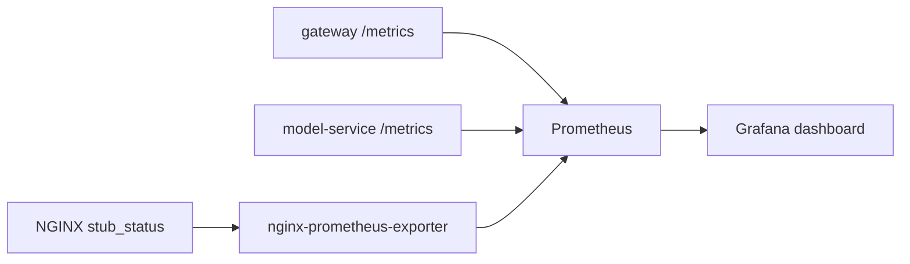

# Monitoring with Prometheus and Grafana

## From Architecture to Monitoring

In branch `01-architecture-base`, we built the application and made sure every service already exposes a `/metrics` endpoint. That was a deliberate architectural decision: preparing for monitoring from day one.

This branch activates the monitoring non-functional requirement defined on `main`. Prometheus now collects the metrics that the services already expose, and Grafana turns them into dashboards.

The question we answer here: **what is happening in the system right now?**

## Metric Flow



Use this diagram while teaching:

- application services expose business and HTTP metrics
- the exporter turns NGINX status into Prometheus metrics
- Prometheus scrapes
- Grafana visualizes

## Monitoring Scope

- Prometheus scrapes metrics exposed by the application services
- Grafana renders a compact dashboard for the main API signals
- `nginx-prometheus-exporter` exposes edge-layer metrics
- Streamlit includes an embedded Grafana cockpit for the `admin` user

## Golden Signals Used Here

- `traffic`: how many requests are reaching the system
- `errors`: how many requests fail with `4xx` or `5xx`
- `latency`: how long the main routes take to respond
- `saturation`: whether the system is under pressure through active connections or in-flight requests

## How to Read the Dashboard

Start with the outside-in question:

`Is the system healthy from the user point of view?`

Then read the dashboard in this order:

1. Traffic: do requests reach the gateway at all?
2. Errors: are failures concentrated on auth, inference, or ingress?
3. Latency: is slowdown visible on the gateway, the model service, or both?
4. Saturation: is the edge or the application under pressure first?

This reading order gives students a repeatable investigation habit.

## What Each Metric Means

- `masterclass_http_requests_total`
  - Counts requests by `service`, `method`, `path`, and `status`.
  - Use it to explain traffic shape and to separate healthy calls from errors.

- `masterclass_http_request_duration_seconds`
  - Histogram of request latency by `service`, `method`, and `path`.
  - Use it to explain `p50` and `p95`.
  - `p50` shows the common case; `p95` shows the slower tail.

- `masterclass_http_in_progress_requests`
  - Number of requests currently being processed by a service.
  - Use it to discuss pressure, concurrency, and work in flight.

- `masterclass_active_sessions`
  - Number of non-expired sessions tracked by the gateway.
  - Use it to connect authentication activity with user state.

- `masterclass_predictions_total`
  - Number of predictions by `service` and `label`.
  - Use it to link monitoring to user-facing ML behavior.

## Verified Raw Entry Points

Use these commands before opening Grafana so students can see the data source directly.

Shortcut:

```bash
make demo-targets
```

Underlying commands:

```bash
curl -i -s http://localhost:8080/metrics

curl -s http://localhost:9090/api/v1/targets | python3 -c '
import sys, json
payload = json.load(sys.stdin)
for target in payload["data"]["activeTargets"]:
    print(target["labels"].get("job"), target["health"], target["scrapeUrl"])
'

curl -s 'http://localhost:9090/api/v1/query?query=masterclass_http_requests_total' \
  | python3 -c '
import sys, json
payload = json.load(sys.stdin)
for item in payload["data"]["result"][:8]:
    print(item["metric"], item["value"][1])
'
```

Example output:

```text
HTTP/1.1 404 Not Found
Server: nginx/1.27.5

gateway up http://gateway:8000/metrics
model-service up http://model-service:8001/metrics
nginx up http://nginx-exporter:9113/metrics

{'__name__': 'masterclass_http_requests_total', 'instance': 'gateway:8000', 'job': 'gateway', 'method': 'POST', 'path': '/auth/login', 'service': 'gateway', 'status': '401'} 1
{'__name__': 'masterclass_http_requests_total', 'instance': 'gateway:8000', 'job': 'gateway', 'method': 'POST', 'path': '/api/classify', 'service': 'gateway', 'status': '200'} 1
{'__name__': 'masterclass_http_requests_total', 'instance': 'model-service:8001', 'job': 'model-service', 'method': 'POST', 'path': '/predict', 'service': 'model-service', 'status': '200'} 1
```

Teaching note:

- In this branch, the public NGINX surface does not proxy `/metrics`.
- Prometheus targets and Prometheus queries are the reliable raw monitoring entrypoints.

## Standard Demo Flow

### Scenario 1: Healthy login and classify

Goal:
Create baseline traffic and confirm the system is healthy.

Shortcut:

```bash
make demo-baseline
```

Underlying commands:

```bash
LOGIN="$(curl -i -s http://localhost:8080/auth/login \
  -H 'Content-Type: application/json' \
  -d '{"username":"alice","password":"mlops-demo"}')"

printf '%s\n' "${LOGIN}"

TOKEN="$(printf '%s' "${LOGIN}" | tail -n 1 \
  | python3 -c 'import sys, json; print(json.load(sys.stdin)["access_token"])')"

sleep 5

curl -i -s http://localhost:8080/api/classify \
  -H "Authorization: Bearer ${TOKEN}" \
  -H 'Content-Type: application/json' \
  -d '{"text":"My payment failed and I need a refund for my subscription."}'
```

Example output:

```text
HTTP/1.1 200 OK
{"access_token":"<token>","token_type":"bearer","username":"alice","expires_at":"2026-04-01T20:23:00.579204"}

HTTP/1.1 200 OK
{"result":{"label":"billing","confidence":0.8500000000000001,"processing_time_ms":0.029625000024680048},"history":[{"text":"My payment failed and I need a refund for my subscription.","predicted_label":"billing","confidence":0.8500000000000001,"created_at":"2026-04-01T18:53:06.422567"}]}
```

What changed operationally:

- Gateway request count rose for `/auth/login` and `/api/classify`.
- Model-service request count rose for `/predict`.
- Prediction count increased for label `billing`.

How to explain it live:

- Healthy traffic should increase traffic and prediction counters without pushing errors up.
- This is the baseline that makes later failures and spikes easier to interpret.

Common learner confusion:

- One request does not create a meaningful latency trend.
- Use this moment to explain why Prometheus stores a series over time, not just the last value.

Expected dashboard focus:

- gateway request rate
- model-service request rate
- prediction counts by label
- active sessions

Underlying metrics:

- `masterclass_http_requests_total`
- `masterclass_predictions_total`
- `masterclass_active_sessions`

### Scenario 2: Authentication failure

Goal:
Generate an error on the gateway only.

Shortcut:

```bash
make demo-auth-failure
```

Underlying command:

```bash
curl -i -s http://localhost:8080/auth/login \
  -H 'Content-Type: application/json' \
  -d '{"username":"alice","password":"wrong-password"}'
```

Example output:

```text
HTTP/1.1 401 Unauthorized
{"detail":"Invalid credentials"}
```

What changed operationally:

- Gateway error traffic increased on `/auth/login`.
- Model-service metrics stayed flat.

How to explain it live:

- This is a clean example of a failure that is visible in metrics and easy to localize.
- Metrics already tell us where to look first: the auth path, not inference.

Common learner confusion:

- A correct rejection is still an error from a monitoring perspective because it changes the user experience.

Expected dashboard focus:

- gateway error rate
- request count split by status code

Underlying metrics:

- `masterclass_http_requests_total{status="401"}`

### Scenario 3: Ingress pressure

Goal:
Show that the edge can reject pressure before the services tell the full story.

Shortcut:

```bash
make demo-burst
```

Underlying command:

```bash
for _ in $(seq 1 12); do
  curl -s -o /dev/null -w '%{http_code}\n' http://localhost:8080/auth/login \
    -H 'Content-Type: application/json' \
    -d '{"username":"alice","password":"mlops-demo"}'
done
```

Example output:

```text
200
200
200
200
503
503
503
503
503
503
503
503
```

What changed operationally:

- Edge traffic spiked.
- In the verified local stack, the ingress rejects excess traffic with `503`.
- Prometheus still shows NGINX-side signals even though not every request reaches the gateway.
- The exact number of initial `200` responses can vary with recent traffic in the current rate-limit window.

How to explain it live:

- This demonstrates why monitoring the edge separately from the application matters.
- Students should learn that symptoms at the edge can hide part of the application picture.

Common learner confusion:

- Some setups return `429` for throttling. This branch currently produces `503`, and the workshop should teach the system as it actually behaves.

Expected dashboard focus:

- ingress traffic spike
- accepted login requests per minute on the gateway
- active NGINX connections
- gateway in-progress requests

Underlying metrics:

- NGINX exporter metrics from `nginx-prometheus-exporter`
- `masterclass_http_in_progress_requests`
- accepted gateway login traffic from `masterclass_http_requests_total`

Important limitation on this branch:

- The dashboard can show accepted login traffic, but it cannot show an exact blocked-request count.
- The bundled NGINX exporter here does not provide the per-status or per-route edge counters needed to compute blocked `503` requests.

## Why Metrics Are Not Enough

Metrics answer:

- is traffic increasing?
- are failures increasing?
- is latency rising?
- is the system under pressure?

Metrics do not fully answer:

- which individual request was slow?
- why that exact request was slow?
- what happened inside the gateway versus inside the model service?

That is the transition to the next branch (`03-observability-otel`): metrics are excellent at locating symptoms, but weak at reconstructing one request end to end. To answer **why** something happened, we need logs and traces.
