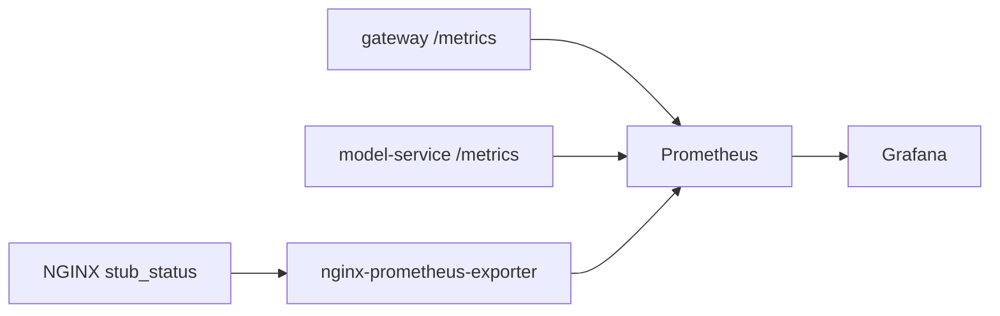

# Monitoring with Prometheus and Grafana

## Application Context

This final branch keeps the same monitoring layer as the dedicated monitoring branch and adds logs and traces on top of it.

The monitoring question stays the same:

`What is happening in the system right now?`

Metrics remain the fastest way to answer that question before opening logs or traces.

## Metric Flow



Use this diagram to frame the monitoring story:

- services emit metrics
- Prometheus scrapes them
- Grafana renders them
- observability tools add depth later, but monitoring still gives the first answer

## Golden Signals Used Here

- `traffic`: how many requests are reaching the system
- `errors`: how many requests fail with `4xx` or `5xx`
- `latency`: how long the main routes take to respond
- `saturation`: whether the system is under pressure through active connections or in-flight requests

## What the Dashboard Shows

- gateway request rate
- gateway error rate
- gateway `p50` and `p95` latency
- model-service `p50` and `p95` latency
- in-progress API requests
- active NGINX connections
- active sessions
- predictions grouped by class

## How to Read the Dashboard

Read the monitoring dashboard in this order:

1. Is traffic present?
2. Are errors rising?
3. Is latency rising?
4. Is pressure visible on the edge or in the services?

This gives a fast diagnosis before diving into a single request.

## Metrics Used in the Demo

- `masterclass_http_requests_total`
  - Request counts by service, route, method, and status.
  - Use it to separate healthy traffic from error traffic.

- `masterclass_http_request_duration_seconds`
  - Latency histogram for gateway and model-service routes.
  - Use it to compare fast requests and slower requests.

- `masterclass_http_in_progress_requests`
  - Requests currently being handled.
  - Use it to discuss pressure and concurrency.

- `masterclass_active_sessions`
  - Current active session count on the gateway.
  - Use it to connect auth behavior with state.

- `masterclass_predictions_total`
  - Prediction count by label.
  - Use it to connect infrastructure monitoring with model-facing behavior.

## Verified Monitoring Entry Points

Shortcut:

```bash
make demo-backends
```

Underlying commands:

```bash
curl -s http://localhost:9090/api/v1/targets | python3 -c '
import sys, json
payload = json.load(sys.stdin)
for target in payload["data"]["activeTargets"]:
    print(target["labels"].get("job"), target["health"], target["scrapeUrl"])
'

curl -s 'http://localhost:9090/api/v1/query?query=masterclass_http_requests_total' \
  | python3 -c '
import sys, json
payload = json.load(sys.stdin)
for item in payload["data"]["result"][:10]:
    print(item["metric"], item["value"][1])
'
```

Example output:

```text
gateway up http://gateway:8000/metrics
model-service up http://model-service:8001/metrics
nginx up http://nginx-exporter:9113/metrics

{'__name__': 'masterclass_http_requests_total', 'instance': 'gateway:8000', 'job': 'gateway', 'method': 'POST', 'path': '/auth/login', 'service': 'gateway', 'status': '200'} 9
{'__name__': 'masterclass_http_requests_total', 'instance': 'gateway:8000', 'job': 'gateway', 'method': 'POST', 'path': '/api/classify', 'service': 'gateway', 'status': '200'} 5
{'__name__': 'masterclass_http_requests_total', 'instance': 'model-service:8001', 'job': 'model-service', 'method': 'POST', 'path': '/predict', 'service': 'model-service', 'status': '200'} 5
```

What to explain live:

- Monitoring still starts in Prometheus even in the observability branch.
- Prometheus tells you what data exists before Grafana turns it into panels.

## Standard Demo Flow

### Scenario 1: Fast request baseline

Goal:
Create a known-good request with a small latency.

Shortcut:

```bash
make demo-fast
```

Underlying commands:

```bash
LOGIN="$(curl -i -s http://localhost:8080/auth/login \
  -H 'Content-Type: application/json' \
  -d '{"username":"alice","password":"mlops-demo"}')"

TOKEN="$(printf '%s' "${LOGIN}" | tail -n 1 \
  | python3 -c 'import sys, json; print(json.load(sys.stdin)["access_token"])')"

sleep 2

curl -i -s http://localhost:8080/api/classify \
  -H "Authorization: Bearer ${TOKEN}" \
  -H 'Content-Type: application/json' \
  -d '{"text":"Refund please."}'
```

Example output:

```text
HTTP/1.1 200 OK
x-request-id: ztWg3aTI4AA
{"result":{"label":"billing","confidence":0.65,"processing_time_ms":0.05241700000624405},"history":[{"text":"Refund please.","predicted_label":"billing","confidence":0.65,"created_at":"2026-04-01T18:54:37.321445"}]}
```

What changed operationally:

- Traffic increased on gateway and model-service.
- Latency stayed low.
- Prediction counts increased for `billing`.

How to explain it live:

- Use this as the reference shape for healthy traffic.

Expected panels:

- gateway traffic
- model-service traffic
- prediction distribution
- latency panels near baseline

### Scenario 2: Slower request

Goal:
Trigger a slower path that metrics can detect before logs and traces explain it.

Shortcut:

```bash
make demo-slow
```

Underlying command:

```bash
LOGIN="$(curl -i -s http://localhost:8080/auth/login \
  -H 'Content-Type: application/json' \
  -d '{"username":"alice","password":"mlops-demo"}')"

TOKEN="$(printf '%s' "${LOGIN}" | tail -n 1 \
  | python3 -c 'import sys, json; print(json.load(sys.stdin)["access_token"])')"

sleep 2

curl -i -s http://localhost:8080/api/classify \
  -H "Authorization: Bearer ${TOKEN}" \
  -H 'Content-Type: application/json' \
  -d '{"text":"My account login has latency issues after the password reset."}'
```

Example output:

```text
HTTP/1.1 200 OK
x-request-id: 1r59MPi1pEQ
{"result":{"label":"account","confidence":0.8500000000000001,"processing_time_ms":353.25243300030706},"history":[{"text":"My account login has latency issues after the password reset.","predicted_label":"account","confidence":0.8500000000000001,"created_at":"2026-04-01T18:54:37.681423"}]}
```

What changed operationally:

- The request stayed successful, but latency increased sharply.
- Metrics can already tell you that the classify path is slower than baseline.

How to explain it live:

- Monitoring tells you that something changed.
- It does not yet tell you which log line or span explains the change.

Expected panels:

- higher `/api/classify` latency on the gateway
- higher `/predict` latency on model-service

Underlying metrics:

- `masterclass_http_request_duration_seconds`

### Scenario 3: Ingress pressure

Goal:
Show a metric pattern that comes from the edge rather than from the application.

Shortcut:

```bash
make demo-burst
```

Underlying command:

```bash
for _ in $(seq 1 12); do
  curl -s -o /dev/null -w '%{http_code}\n' http://localhost:8080/auth/login \
    -H 'Content-Type: application/json' \
    -d '{"username":"alice","password":"mlops-demo"}'
done
```

Example output:

```text
200
200
503
503
503
503
503
503
503
503
503
503
```

What changed operationally:

- Edge traffic spiked.
- The verified local stack shows ingress throttling as `503`.
- This pattern is distinct from a slow but successful application request.
- The exact point where `200` turns into `503` depends on recent traffic in the same rate-limit window.

How to explain it live:

- Metrics help distinguish “application slow” from “edge rejecting”.
- This is where NGINX exporter panels become useful.

Expected panels:

- active NGINX connections
- ingress traffic spike
- weaker downstream application traffic than the raw burst suggests

## Why Monitoring Is Still Incomplete

Monitoring answers:

- what changed?
- when did it change?
- how broad is the impact?

Monitoring does not fully answer:

- which request was the one you should inspect?
- what exact context caused the slowdown?
- which log line or span proves the cause?

That is where the observability layer starts.
