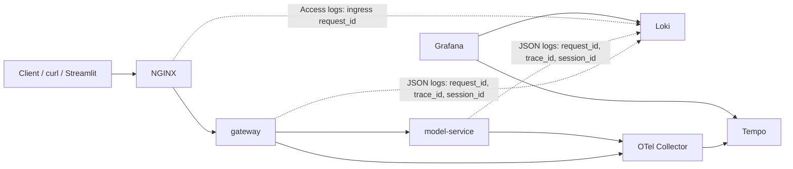

# Observability with OpenTelemetry, Loki, and Tempo

## From Monitoring to Observability

In branch `02-monitoring-prometheus-grafana`, we activated the monitoring non-functional requirement: Prometheus collects metrics, Grafana displays dashboards, and you can detect symptoms like traffic spikes, error increases, or latency changes.

This branch activates the **observability non-functional requirement** defined on `main`. Services now produce structured logs and distributed traces, so an investigation can move from symptoms to causes.

The question we answer here: **why is this happening?**

The system still exposes the same login and classification flows, but each request now leaves more diagnostic evidence across services.

## Correlation Flow



Use this diagram to explain the observability split:

- the response header gives the first correlation handle: `x-request-id`
- gateway and model-service logs keep the same application request context
- traces give timing structure
- NGINX logs still help, but ingress correlation is not fully unified yet

## Observability Scope

- OpenTelemetry instrumentation in the gateway and model service
- OpenTelemetry Collector for trace intake and forwarding
- Tempo for distributed traces
- Loki and Promtail for log collection
- Grafana as the place where metrics, logs, and traces meet
- Streamlit embeds both monitoring and observability cockpits for the `admin` user

## What Gets Correlated

- `request_id`
  - Returned to the caller as `x-request-id`
  - Propagated between gateway and model-service
  - Good first search key in logs

- `trace_id` and `span_id`
  - Added to structured logs
  - Used to connect logs and Tempo traces

- `user_id` and `session_id`
  - Added after authentication in the application tier
  - Useful for auth and session investigations

- `service`
  - Separates gateway, model-service, and NGINX evidence

## How Request Context Is Attached

At a high level:

1. Gateway creates or accepts a request ID.
2. Gateway binds request context for logs.
3. Gateway starts a trace span and propagates context downstream.
4. Model-service receives the propagated context.
5. Model-service writes logs with the same application identifiers.
6. NGINX also logs the request, but currently with its own ingress-generated request ID.

This is enough for strong app-level correlation, even if ingress-level continuity is not yet complete.

## Standard Investigation Flow

### Scenario 1: Start from a fast request

Goal:
Capture the smallest useful unit of observability: response header plus loggable application context.

Shortcut:

```bash
make demo-fast
```

Underlying commands:

```bash
LOGIN="$(curl -i -s http://localhost:8080/auth/login \
  -H 'Content-Type: application/json' \
  -d '{"username":"alice","password":"mlops-demo"}')"

TOKEN="$(printf '%s' "${LOGIN}" | tail -n 1 \
  | python3 -c 'import sys, json; print(json.load(sys.stdin)["access_token"])')"

sleep 2

curl -i -s http://localhost:8080/api/classify \
  -H "Authorization: Bearer ${TOKEN}" \
  -H 'Content-Type: application/json' \
  -d '{"text":"Refund please."}'
```

Example output:

```text
HTTP/1.1 200 OK
x-request-id: ztWg3aTI4AA
{"result":{"label":"billing","confidence":0.65,"processing_time_ms":0.05241700000624405},"history":[{"text":"Refund please.","predicted_label":"billing","confidence":0.65,"created_at":"2026-04-01T18:54:37.321445"}]}
```

What changed operationally:

- One fast request crossed the full application path.
- The response exposes the request identifier immediately.

How to explain it live:

- This shows the “entry ticket” into observability.
- Before opening Grafana, you already know which request to search for.

Common learner confusion:

- `x-request-id` is visible to the caller.
- `trace_id` is internal instrumentation context that appears in logs and traces.

### Scenario 2: Compare a fast request and a slower request

Goal:
Show how observability complements monitoring by explaining a latency jump.

Shortcut:

```bash
make demo-slow
```

Underlying commands:

```bash
LOGIN="$(curl -i -s http://localhost:8080/auth/login \
  -H 'Content-Type: application/json' \
  -d '{"username":"alice","password":"mlops-demo"}')"

TOKEN="$(printf '%s' "${LOGIN}" | tail -n 1 \
  | python3 -c 'import sys, json; print(json.load(sys.stdin)["access_token"])')"

sleep 2

curl -i -s http://localhost:8080/api/classify \
  -H "Authorization: Bearer ${TOKEN}" \
  -H 'Content-Type: application/json' \
  -d '{"text":"My account login has latency issues after the password reset."}'
```

Example output:

```text
HTTP/1.1 200 OK
x-request-id: 1r59MPi1pEQ
{"result":{"label":"account","confidence":0.8500000000000001,"processing_time_ms":353.25243300030706},"history":[{"text":"My account login has latency issues after the password reset.","predicted_label":"account","confidence":0.8500000000000001,"created_at":"2026-04-01T18:54:37.681423"}]}
```

Side-by-side interpretation:

| Request | Text | Label | Processing time | Teaching point |
| --- | --- | --- | --- | --- |
| Fast path | `Refund please.` | `billing` | about `0.05 ms` | healthy baseline |
| Slow path | `My account login has latency issues after the password reset.` | `account` | about `353 ms` | same route, degraded experience |

What changed operationally:

- The response stayed `200`, but the model took much longer.
- Metrics tell us the path slowed down.
- Logs and traces tell us which request slowed down and where to inspect it.

How to explain it live:

- Monitoring tells you that a path is slower.
- Observability tells you which request to inspect and what context it carried.

Common learner confusion:

- A successful request can still be the subject of an incident discussion.

### Scenario 3: Correlate the slower request in gateway and model-service logs

Goal:
Find the same request in both services and show shared `request_id`, `session_id`, and `trace_id`.

Shortcut:

```bash
make demo-correlate
```

Underlying commands:

```bash
REQUEST_ID="1r59MPi1pEQ"

rg -n "$REQUEST_ID" data/logs/gateway.log data/logs/model-service.log
```

Example output:

```text
data/logs/model-service.log:7:{"timestamp":"2026-04-01T18:54:37.671663+00:00","message":"prediction_completed","service":"model-service","request_id":"1r59MPi1pEQ","session_id":"9","trace_id":"307026916f251c54ece9bec9c8328dad","slow_path":true}
data/logs/gateway.log:33:{"timestamp":"2026-04-01T18:54:37.677076+00:00","message":"HTTP Request: POST http://model-service:8001/predict \"HTTP/1.1 200 OK\"","service":"gateway","request_id":"1r59MPi1pEQ","session_id":"9","trace_id":"307026916f251c54ece9bec9c8328dad"}
data/logs/gateway.log:35:{"timestamp":"2026-04-01T18:54:37.691591+00:00","message":"prediction_recorded","service":"gateway","request_id":"1r59MPi1pEQ","session_id":9,"trace_id":"307026916f251c54ece9bec9c8328dad","label":"account"}
```

What changed operationally:

- The application tier is strongly correlated.
- The same request can be followed across services with shared identifiers.
- `make demo-slow` stores the latest request id in `data/logs/demo-last-request-id.txt`, so `make demo-correlate` can replay the search without manual copy and paste.

How to explain it live:

- This is the main payoff of structured logs and distributed tracing.
- You can now move from a symptom to a concrete request narrative.

Common learner confusion:

- The gateway log entry from `httpx` is still part of the same request story.

### Scenario 4: Show the current ingress correlation limit

Goal:
Be explicit about what the current observability setup does not yet provide.

Shortcut:

```bash
make demo-correlate
```

Underlying command:

```bash
tail -n 6 data/logs/nginx/access.log
```

Example output:

```text
{"timestamp":"2026-04-01T18:54:37+00:00","service":"nginx","request_method":"POST","request_uri":"/api/classify","status":200,"request_time":0.408,"request_id":"d34cb267b41c7601651927f0b8ba59d4"}
```

What changed operationally:

- NGINX proves that the ingress saw the request and measured its own request time.
- The ingress `request_id` is not the same as the application `request_id`.

How to explain it live:

- This is still useful evidence, but it is a different correlation domain.
- The current branch is strong for app-level correlation, weaker for ingress-wide end-to-end request-id continuity.

Common learner confusion:

- Different request IDs do not mean the logs are wrong.
- They mean the correlation design is not yet unified across every layer.

### Scenario 5: Contrast application slowdown with ingress rejection

Goal:
End with a failure mode that is visible first at the edge.

Shortcut:

```bash
make demo-burst
```

Underlying command:

```bash
for _ in $(seq 1 12); do
  curl -s -o /dev/null -w '%{http_code}\n' http://localhost:8080/auth/login \
    -H 'Content-Type: application/json' \
    -d '{"username":"alice","password":"mlops-demo"}'
done
```

Example output:

```text
200
200
503
503
503
503
503
503
503
503
503
503
```

What changed operationally:

- This time the ingress is the main source of failure.
- The verified stack surfaces rate limiting as `503`.
- The exact number of early `200` responses varies with recent traffic in the same rate-limit window.

How to explain it live:

- Slow classify and blocked login are different investigation patterns.
- The `Rate-Limited Login Requests` panel in the Observability Overview dashboard shows the exact rejected NGINX entries.
- Logs and traces are useful, but you still need the edge story.

## Why Logs and Traces Complement Metrics

Metrics answer:

- what changed?
- how much did it change?
- how long has it been happening?

Logs and traces answer:

- which request was involved?
- what context did that request carry?
- where was time spent?
- which service recorded the key event?

The strongest operational habit to teach is:

1. start with the symptom in metrics or the user response
2. grab the request identifier
3. pivot to logs
4. pivot to traces when timing structure matters

## What We Could Do Next

- Propagate one consistent request ID from NGINX to the application tier.
- Add richer correlation headers at the ingress.
- Instrument the database layer with spans so persistence becomes visible in traces.
- Add exemplars or tighter trace links from metrics into Tempo.
- Layer alerting and SLOs on top of the current metrics.
- Add business and model-quality metrics beside the technical metrics.
- Expand structured logging around authentication failures and other edge cases.
