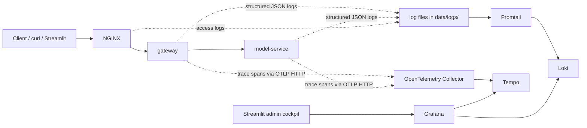

# Observability with OpenTelemetry, Loki, and Tempo

## From Monitoring to Observability

In branch `02-monitoring-prometheus-grafana`, we activated the monitoring non-functional requirement: Prometheus collects metrics, Grafana displays dashboards, and you can detect symptoms like traffic spikes, error increases, or latency changes.

This branch activates the **observability non-functional requirement** defined on `main`. Services now produce structured logs and distributed traces, so an investigation can move from symptoms to causes.

The question we answer here: **why is this happening?**

The system still exposes the same login and classification flows, but each request now leaves more diagnostic evidence across services.

## The Stack in One Picture



This is the simplest way to describe the branch:

- the application still runs through `NGINX -> gateway -> model-service`
- logs are written to files first, then shipped by Promtail into Loki
- traces are emitted by the Python services to the OpenTelemetry Collector, then stored in Tempo
- Grafana reads Loki and Tempo
- Streamlit embeds the monitoring and observability dashboards for the admin demo

## Component Cheat Sheet

| Component | What it is | What it stores or forwards | Where you use it in the demo |
| --- | --- | --- | --- |
| OpenTelemetry | A standard for instrumentation | Trace context, spans, and propagation headers | Inside `gateway` and `model-service` code |
| OpenTelemetry Collector | A small pipeline service | Receives spans from apps, batches them, forwards them | Between the apps and Tempo |
| Tempo | A trace backend | Distributed traces and span trees | To inspect timing and request structure |
| Promtail | A log shipper | Reads local log files and pushes them to Loki | Between `data/logs/` and Loki |
| Loki | A log backend | Structured logs with labels | To search by `request_id`, `trace_id`, `status`, or `service` |
| Grafana | The investigation UI | Reads metrics, logs, and traces from other systems | To pivot between dashboards, logs, and traces |

## What Each Piece Means in Plain Language

- **OpenTelemetry**
  - This is not a storage system.
  - It is the instrumentation language the services use to say: "a request started here, then this span happened, then that downstream call happened."
  - In this repository, OpenTelemetry is used in the Python services to create spans and propagate trace context.

- **OpenTelemetry Collector**
  - Think of it as a relay for telemetry.
  - The apps send spans to the collector at `http://otel-collector:4318`.
  - The collector batches and forwards them to Tempo.
  - In this repo, the trace pipeline is defined in [collector.yaml](/Users/seb/Documents/masterclass_monitoring_observability_mlops/docker/otel/collector.yaml#L1).

- **Tempo**
  - Tempo is where traces are stored.
  - If you want to see a trace tree, a parent span, child spans, and where time was spent, Tempo is the backend that answers that.
  - In Grafana, Tempo is the trace datasource behind the `Recent Tempo Traces` section and trace exploration.

- **Promtail**
  - Promtail reads log files from disk and pushes them to Loki.
  - It also extracts useful labels such as `request_id`, `trace_id`, and `status`.
  - In this repo, Promtail reads files under `data/logs/` and forwards them to Loki.

- **Loki**
  - Loki stores logs and makes them searchable.
  - If you want to ask "show me all gateway logs for this request id" or "show me all NGINX `503` login rejections", Loki is the backend that answers that.

- **Grafana**
  - Grafana is not where logs or traces are stored.
  - It is the UI that queries Loki and Tempo and shows the results side by side.
  - This is why the observability dashboard can show raw NGINX logs, application logs, and a derived blocked-login panel in one place.

## Where the Data Goes in This Repo

### Traces

1. `gateway` and `model-service` create spans with OpenTelemetry.
2. Both services send those spans to `otel-collector` using OTLP HTTP.
3. The collector forwards the spans to Tempo.
4. Grafana reads Tempo to display trace trees and search results.

Code and config:

- Trace setup in [observability.py](/Users/seb/Documents/masterclass_monitoring_observability_mlops/src/shared/observability.py#L142)
- Collector pipeline in [collector.yaml](/Users/seb/Documents/masterclass_monitoring_observability_mlops/docker/otel/collector.yaml#L1)
- Tempo storage in [tempo.yaml](/Users/seb/Documents/masterclass_monitoring_observability_mlops/docker/tempo/tempo.yaml#L1)

### Logs

1. `gateway` and `model-service` write structured JSON logs.
2. `NGINX` writes JSON access logs.
3. Promtail tails those log files from `data/logs/`.
4. Promtail extracts labels and pushes the logs into Loki.
5. Grafana queries Loki for raw logs and log-derived panels.

Code and config:

- JSON log format in [observability.py](/Users/seb/Documents/masterclass_monitoring_observability_mlops/src/shared/observability.py#L82)
- NGINX log format in [nginx.conf](/Users/seb/Documents/masterclass_monitoring_observability_mlops/docker/nginx/nginx.conf#L4)
- Promtail pipelines in [promtail.yaml](/Users/seb/Documents/masterclass_monitoring_observability_mlops/docker/promtail/promtail.yaml#L1)

## Quick Mental Model

- Metrics answer: "something changed"
- Logs answer: "what exactly happened"
- Traces answer: "where the time went"

When teaching this branch, the easiest explanation is:

1. Prometheus already told us the system changed.
2. Loki lets us search the exact request and exact rejection events.
3. Tempo lets us see the timing breakdown inside accepted requests.

## Observability Scope

- OpenTelemetry instrumentation in the gateway and model service
- OpenTelemetry Collector for trace intake and forwarding
- Tempo for distributed traces
- Loki and Promtail for log collection
- Grafana as the place where metrics, logs, and traces meet
- Streamlit embeds both monitoring and observability cockpits for the `admin` user

## What Gets Correlated

- `request_id`
  - Returned to the caller as `x-request-id`
  - Propagated between gateway and model-service
  - Good first search key in logs

- `trace_id` and `span_id`
  - Added to structured logs
  - Used to connect logs and Tempo traces

- `user_id` and `session_id`
  - Added after authentication in the application tier
  - Useful for auth and session investigations

- `service`
  - Separates gateway, model-service, and NGINX evidence

## How Request Context Is Attached

At a high level:

1. Gateway creates or accepts a request ID.
2. Gateway binds request context for logs.
3. Gateway starts a trace span and propagates context downstream.
4. Model-service receives the propagated context.
5. Model-service writes logs with the same application identifiers.
6. NGINX also logs the request, but currently with its own ingress-generated request ID.

This is enough for strong app-level correlation, even if ingress-level continuity is not yet complete.

## Useful Commands Before the Scenarios

Start or rebuild the full local stack:

```bash
make up
```

Check that the main services are ready:

```bash
make demo-ready
```

Check that Prometheus and Grafana see the expected backends:

```bash
make demo-backends
```

## Standard Investigation Flow

### Scenario 1: Start from a fast request

Goal:
Capture the smallest useful unit of observability: response header plus loggable application context.

Shortcut:

```bash
make demo-fast
```

Underlying commands:

```bash
LOGIN="$(curl -i -s http://localhost:8080/auth/login \
  -H 'Content-Type: application/json' \
  -d '{"username":"alice","password":"mlops-demo"}')"

TOKEN="$(printf '%s' "${LOGIN}" | tail -n 1 \
  | python3 -c 'import sys, json; print(json.load(sys.stdin)["access_token"])')"

sleep 2

curl -i -s http://localhost:8080/api/classify \
  -H "Authorization: Bearer ${TOKEN}" \
  -H 'Content-Type: application/json' \
  -d '{"text":"Refund please."}'
```

Example output:

```text
HTTP/1.1 200 OK
x-request-id: ztWg3aTI4AA
{"result":{"label":"billing","confidence":0.65,"processing_time_ms":0.05241700000624405},"history":[{"text":"Refund please.","predicted_label":"billing","confidence":0.65,"created_at":"2026-04-01T18:54:37.321445"}]}
```

What changed operationally:

- One fast request crossed the full application path.
- The response exposes the request identifier immediately.

How to explain it live:

- This shows the “entry ticket” into observability.
- Before opening Grafana, you already know which request to search for.

Common learner confusion:

- `x-request-id` is visible to the caller.
- `trace_id` is internal instrumentation context that appears in logs and traces.

### Scenario 2: Compare a fast request and a slower request

Goal:
Show how observability complements monitoring by explaining a latency jump.

Shortcut:

```bash
make demo-slow
```

Underlying commands:

```bash
LOGIN="$(curl -i -s http://localhost:8080/auth/login \
  -H 'Content-Type: application/json' \
  -d '{"username":"alice","password":"mlops-demo"}')"

TOKEN="$(printf '%s' "${LOGIN}" | tail -n 1 \
  | python3 -c 'import sys, json; print(json.load(sys.stdin)["access_token"])')"

sleep 2

curl -i -s http://localhost:8080/api/classify \
  -H "Authorization: Bearer ${TOKEN}" \
  -H 'Content-Type: application/json' \
  -d '{"text":"My account login has latency issues after the password reset."}'
```

Example output:

```text
HTTP/1.1 200 OK
x-request-id: 1r59MPi1pEQ
{"result":{"label":"account","confidence":0.8500000000000001,"processing_time_ms":353.25243300030706},"history":[{"text":"My account login has latency issues after the password reset.","predicted_label":"account","confidence":0.8500000000000001,"created_at":"2026-04-01T18:54:37.681423"}]}
```

Side-by-side interpretation:

| Request | Text | Label | Processing time | Teaching point |
| --- | --- | --- | --- | --- |
| Fast path | `Refund please.` | `billing` | about `0.05 ms` | healthy baseline |
| Slow path | `My account login has latency issues after the password reset.` | `account` | about `353 ms` | same route, degraded experience |

What changed operationally:

- The response stayed `200`, but the model took much longer.
- Metrics tell us the path slowed down.
- Logs and traces tell us which request slowed down and where to inspect it.

How to explain it live:

- Monitoring tells you that a path is slower.
- Observability tells you which request to inspect and what context it carried.

Common learner confusion:

- A successful request can still be the subject of an incident discussion.

### Scenario 3: Correlate the slower request in gateway and model-service logs

Goal:
Run the real three-pillar investigation flow from one slow request.

Shortcut:

```bash
make demo-correlate
```

What `make demo-correlate` does now:

```bash
1. reads the latest request id from data/logs/demo-last-request-id.txt
2. finds matching gateway and model-service logs
3. extracts the trace id
4. queries Tempo for the span breakdown
5. queries Prometheus for p95 confirmation
```

Example output:

```text
=== Step 1: Find the request in structured logs (Loki) ===
REQUEST_ID=1r59MPi1pEQ

09:04:23.671  model-service   prediction_completed
09:04:23.675  gateway         HTTP Request: POST http://model-service:
09:04:23.676  gateway         model_service_response_received
09:04:23.687  gateway         prediction_recorded

=== Step 2: Follow the trace in Tempo ===
TRACE_ID=307026916f251c54ece9bec9c8328dad

Span breakdown (queried from Tempo):
Span                                       Duration
----------------------------------------------------
POST /api/classify                          386.0 ms
gateway.session_lookup                        1.5 ms
gateway.forward_prediction                  370.0 ms
POST /predict                               358.5 ms
model.inference                             355.8 ms
model.keyword_scoring                         0.1 ms
gateway.store_prediction_history             11.5 ms

=== Step 3: Confirm with Prometheus metrics ===
Gateway /api/classify p95:       0.475 s
Model-service /predict p95:      0.475 s
```

What changed operationally:

- One command now walks the same incident through logs, traces, and metrics.
- `make demo-slow` stores the latest request id in `data/logs/demo-last-request-id.txt`, so `make demo-correlate` can replay the investigation without manual copy and paste.

How to explain it live:

- This is the main payoff of the observability stack.
- Loki tells you which request to inspect.
- Tempo tells you where time was spent.
- Prometheus tells you whether the slow request is isolated or part of a broader pattern.

Common learner confusion:

- The gateway log entry from `httpx` is still part of the same request story.

### Scenario 4: Show the current ingress correlation limit

Goal:
Be explicit about what the current observability setup does not yet provide.

Shortcut:

```bash
make demo-correlate
```

Underlying command:

```bash
tail -n 6 data/logs/nginx/access.log
```

Example output:

```text
{"timestamp":"2026-04-01T18:54:37+00:00","service":"nginx","request_method":"POST","request_uri":"/api/classify","status":200,"request_time":0.408,"request_id":"d34cb267b41c7601651927f0b8ba59d4"}
```

What changed operationally:

- NGINX proves that the ingress saw the request and measured its own request time.
- The ingress `request_id` is not the same as the application `request_id`.

How to explain it live:

- This is still useful evidence, but it is a different correlation domain.
- The current branch is strong for app-level correlation, weaker for ingress-wide end-to-end request-id continuity.

Common learner confusion:

- Different request IDs do not mean the logs are wrong.
- They mean the correlation design is not yet unified across every layer.

### Scenario 5: Contrast application slowdown with ingress rejection

Goal:
End with a failure mode that is visible first at the edge.

Shortcut:

```bash
make demo-burst
```

Underlying command:

```bash
for _ in $(seq 1 12); do
  curl -s -o /dev/null -w '%{http_code}\n' http://localhost:8080/auth/login \
    -H 'Content-Type: application/json' \
    -d '{"username":"alice","password":"mlops-demo"}'
done
```

Example output:

```text
200
200
503
503
503
503
503
503
503
503
503
503
```

What changed operationally:

- This time the ingress is the main source of failure.
- The verified stack surfaces rate limiting as `503`.
- The exact number of early `200` responses varies with recent traffic in the same rate-limit window.

How to explain it live:

- Slow classify and blocked login are different investigation patterns.
- The `Blocked Login Requests per Minute` panel in the Observability Overview dashboard counts rejected `503` logins from Loki.
- Logs and traces are useful, but you still need the edge story.

## Why Logs and Traces Complement Metrics

Metrics answer:

- what changed?
- how much did it change?
- how long has it been happening?

Logs and traces answer:

- which request was involved?
- what context did that request carry?
- where was time spent?
- which service recorded the key event?

The strongest operational habit to teach is:

1. start with the symptom in metrics or the user response
2. grab the request identifier
3. pivot to logs
4. pivot to traces when timing structure matters

## What We Could Do Next

- Propagate one consistent request ID from NGINX to the application tier.
- Add richer correlation headers at the ingress.
- Instrument the database layer with spans so persistence becomes visible in traces.
- Add exemplars or tighter trace links from metrics into Tempo.
- Layer alerting and SLOs on top of the current metrics.
- Add business and model-quality metrics beside the technical metrics.
- Expand structured logging around authentication failures and other edge cases.
